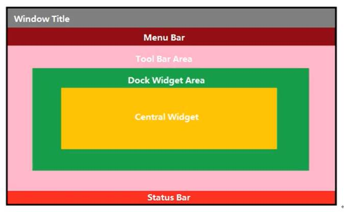

###### 2020-11-2 准备入门QT。服务端开发我还是倾向于java，整个语言生态摆在哪里。但是桌面程序确实不适合使用java写。QT正好弥补整这个短板。
## 1 QT入门
### 1.1 QT是什么，和C++是什么关系
QT是一套代码库，可以编写跨平台编写桌面程序。QT和c++的关系就像Android和java的关系。使用相同的语法，但是QT有自己的api库和内存回收机制。
因为QT主要是做界面开发，因此它和html、android等一样，提供了很多的类(api、标签，你愿意怎么叫都行)，每个类都代表了不同的元素。通过这些元素就能拼凑出不同的界面
### 1.2 信号和槽
类似android的广播机制，但是又有所不同。
connect()函数能接收4个参数，分别是：信号发送者、发送信号的函数声明、信号接收者，接收到信号后的处理函数。
由此可见，信号和槽机制就是用来做事件响应处理的。它的实现步骤如下：
1. 信号发送者在头文件signals下声明一个自定义信号函数，返回值固定为void，只需要声明，不需要实现。signals是QT特有的，可以认为是c++的方言。
2. 信号接收者在头文件中声明一个信号处理函数，这种函数也叫槽函数。槽函数返回值也是void，需要做实现。
早期的槽函数必须写在public slots下，现在可以直接写在public或者全局函数下（QT4以上）。
3. 在调用页面，通过emit注册信号函数，这样就能触发信号了，进而自动触发槽函数。
注意：
1. 信号的触发必须发生在信号连接之后(connect()函数调用后)，未连接就触发信号是不能触发槽函数的。
2. 一个信号可以连接多个槽，这种情况下所有槽都会被一一调用，但是他们的调用顺序是不确定的
3. 多个信号可以连接到一个槽，任意一个信号都会触发槽函数。
4. 一个信号可以和另外一个信号连接，最终形成信号链。
5. 自定义信号和槽函数出现重载时需要利用函数指针，明确指向函数的地址。信号和槽函数的参数类型，顺序必须一致，但是个数可以不同。信号的参数个数可以多余槽函数的参数个数。
<函数指针 void( Teacher:: * tSignal )( QString ) = &Teacher::hungry;>
6. 旧版本(QT4)的槽函数connect()通过SIGNAL和SLOT来调用槽函数，它的处理方式是字符串替换然后执行编译，虽然代码看起来直观，但是编译器不会检测参数类型，不利于排查错误。
### 1.3 QMainWindow整体介绍
关于QMainWindow，QT提供和web 中box模型差不多的概念，将整个窗口划分为6个部分。模型如下：

1. 菜单栏，最多只能有一个，可以没有。
```qt
QMenuBar * bar = MenuBar();//创建菜单
setMenuBar( bar );//将菜单添加到窗口中
QMenu * fileMenu = bar -> addMenu(“文件”);//添加一个菜单
QAction * newAction =  fileMenu ->addAction(“新建”);//添加一个菜单项
fileMenu->addSeparator();
```
2. 工具栏 可以有多个
```qt
// 工具栏，可以有多个
QToolBar *toolBar = new QToolBar(this);
//将工具类添加到窗口中，并指定初始位置
addToolBar(Qt::LeftToolBarArea,toolBar);
// 指定toolbar允许吸附的范围
toolBar->setAllowedAreas(Qt::LeftToolBarArea|Qt::RightToolBarArea);
// 设置f浮动，false下如果将toolbar拖到不允许停靠的地方，松开鼠标时toolbar会自动回到原来的地方
toolBar->setFloatable(false);
// 设置移动的总开关，如果为false，上面的设置都会无效，不允许移动也就不存在拖拽问题了
//toolBar ->setMovable(false);
// 将一个Action添加到工具栏中，Action是可以共用的
toolBar->addAction(newAction);
// 再创建一个按钮，然后将这个按钮也放到toolbar中
QPushButton *button = new QPushButton("按钮二",this);
toolBar->addWidget(button);
```
3. 状态栏，最多一个，可以没有
```qt
//状态栏 最多有一个，可以没有
QStatusBar *staturBar = new QStatusBar(this);
// 将状态栏添加到窗口中
setStatusBar(staturBar);
// 创建一个label
QLabel * label = new QLabel("提示信息",this);
// 将label添加到状态栏中，因为状态栏已经添加到窗口中了，所有label也会同步显示再窗口中
staturBar->addWidget(label);
QLabel * label2 = new QLabel("右侧提示信息",this);
// addPermanentWidget()从右侧开始添加
staturBar->addPermanentWidget(label2);
```
4. 铆接部件 (浮动窗口) 可以有多个
```qt
QDockWidget * dockWidget = new QDockWidget("浮动铆接部件",this);
// 设置铆接部件的初始位置，注意铆接部件默认是浮动的，如果窗口中没有元素，就算将它设置在底部，它还是会浮上去
addDockWidget(Qt::BottomDockWidgetArea,dockWidget);
// 设置铆接部件后期允许吸附的位置
dockWidget->setAllowedAreas(Qt::TopDockWidgetArea|Qt::BottomDockWidgetArea);
//设置中心部件 ，只能有一个
QTextEdit * edit = new QTextEdit(this);
setCentralWidget( edit );
```
菜单栏和状态栏只能有0个或1个，使用api就是上面列举的两个类。中心部件虽然只能有一个，但是中心部件有很多个api实体，你可以在其中填充很多个其他的部件。类似html中的body标签。
### 1.4 资源文件
QT自己提供了一套资源文件管理方式。我们可以在工程上点右键，选择“添加新文件…”，指定资源前缀，后续就能通过前缀加文件路径名访问到相关资源。操作一遍就好，没啥好说的。
### 1.5 对话框QDialog
QT内置了一系列的对话框，用于简化开发，常见的如下：
* QColorDialog：    选择颜色；
* QFileDialog：     选择文件或者目录；
* QFontDialog：			选择字体；
* QInputDialog：		允许用户输入一个值，并将其值返回；
* QMessageBox：			模态对话框，用于显示信息、询问问题等；
* QPageSetupDialog：	为打印机提供纸张相关的选项；
* QPrintDialog：		  打印机配置；
* QPrintPreviewDialog：打印预览；
* QProgressDialog：		显示操作过程。

同时，你也能通过QDialog来实现自定义的对话框。自定义对话款分为两种：模态和非模态。
区别是模态框会阻塞窗口交互，如果不关闭就不能操作窗口的其他区域。
非模态框允许在弹出时继续做其他操作。注意，dialog 是建立在栈上的，show()函数返回，MainWindow::open()函数结束，dialog 超出作用域被析构，因此使用是请使用new确保dialog在堆上建立。
* 使用QDialog::exec()实现应用程序级别的模态对话框
* 使用QDialog::open()实现窗口级别的模态对话框
* 使用QDialog::show()实现非模态对话框。
```qt
void MainWindow::showDialog()
{
//    qDebug()<<"准备显示模态框";
//    QDialog dlg(this);
//    dlg.exec();
//    qDebug() <<"模态框弹出方法";
    // 模态框需要指定大小，太小的模态框不影响使用，但是会有警告信息（调试控制台显示的，用户看不到）。
    QDialog * dig2 =new QDialog(this);
    dig2->resize(200,100);
    dig2->show();
    dig2->setAttribute(Qt::WA_DeleteOnClose);
//    qDebug() <<"模态框弹出方法";
}
```
QT还专门提供了消息对话框，用于提示消息，例如：
```qt
// 测试消息框
void MainWindow::testMessageBox()
{
    // 错误消息框
    QMessageBox::critical(this,"critical","错误");
    // 信息对话框
    QMessageBox::information(this,"info","信息");
    //提问对话框
    if( QMessageBox::Open ==  QMessageBox::question(this,"ques","提问",QMessageBox::Save|QMessageBox::Cancel|QMessageBox::Open)){
           qDebug()<<"选择了打开";
    }else{
           qDebug() << "其他选择";
    }
    QMessageBox::warning(this,"warning","警告");
};
```
最后介绍一下标准文件对话框，功能参考html中的file类型的input框。
```qt
QFileDialog::getOpenFileName(this,"打开文件","C:\\Users\\rock\\Desktop\\qt");
```
其实 消息对话框、模态框、文件对话框都属于对话框的一种，单独列举他们是因为他们使用的太频繁了。
### 1.6 布局管理器
GUI，重点就是布局管理。相比较html和android的布局，个人觉得  QT的布局是最人性化的。其中的widget类似盒子，再配合上弹簧，入门级应用肯定是够用了的。
这个没啥好记录的，多操作几次就好，所有操作都是拖拽的，很nice。
### 1.7 常用控件
QT提供了很多的控件，作用参考html中的各种标签。每种控件都有属于自己的事件，事件间的信号传递通过connect()函数链接调用(ps:我看课程大纲中有一段关于event章节，估计事件还有其他调用方法，后面补充)。这里记录几种常用控件的效果，具体使用时参考demo代码。
1. Button，按钮下衍生出来的控件有6种，常用的有4种。
* Push Button ：常用按钮，一般提供文字和图标等
* Tool Button：主要提供命令和选项，一般会显示图标。
两种button没有本质区别，通过属性设置可以共通
* Radio Button：单选，参考Html种的radio
* Check Box：多选，参考Html种的Checkbox
* command Link Box  可以认为是带图标的button，Dialog Button Box 会直接提供确认和放弃两个选项。和Button什么太大的区别。
可以更直接一点，button分3种：按钮、单选、多选；
2. item Widgets，窗体小部件，这里会使用vue中的组件来类比。
* list Widget：参考无序列表
* Tree Widget：参考vue中的Tree树形控件，可以做出带层级结构的效果
* table Widget: 参考table，就是画一个表格出来
3. Containers，容器部件
* Group Box: 组容器，用来分组，比如窗口中存在多个Radio Button时，它们必须放在各自的Group Box中，不然永远只有一个可以被选中。
* Scroll Area：也是一种分组容器，当容器中的内容过多时会自动提供滚动条。
* Tool Box:参考vue中的Collapse 折叠面板组件。可以实现手风琴效果
* Tab Widget：参考vue中的Tabs 标签页组件。
* Stacked Widget：栈容器，提供上一步，下一步的功能，参考分页中的上下页切换。该控件在设计页面会显示为两个箭头，但是实际页面不会有，需要自己定义button来绑定操作。
* Frame：边框容器，添加边框时使用，参考下面的Widget
* Widget：布局容器，参考html中的div
* Dock Widget：嵌套容器，
其他就不怎么常用了
。。。。。。。其他组件不在一一列举。
### 1.8 QT消息机制和事件
当main函数中的exec()执行后，QT就会进入事件循环，持续监听应用程序事件。
事件分为很多种，常见的有：鼠标事件、键盘事件、大小改变的事件、位置移动的事件，这4种是最常见的。其中鼠键事件尤其重要。
貌似浏览器的事件也是这么设计的。浏览器会存在事件冒泡的特性，而QT种的事件处理都是通过信号和槽来实现的，对于部分不希望被处理，或者希望特例执行的事件，可以通过eventFilter()来定义事件过滤器。
### 1.9 绘图
上述的所有API只能形成界面和简单交互，如果要实现游戏这种连续的交互效果，就需要通过QPainter来连续绘制页面。暂时先跳过这部分内容。

