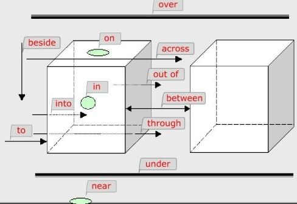

#### lesson 25 Mrs. Smith`s kitchen
Mrs.                /'misiz/                n. 夫人；太太（等于Mistress）
Mistress            美 /ˈmɪstrəs/           n. 称霸的国家；夫人；小姐
mistress 和 Mrs. 是等价的，Mrs. 是简写
kitchen             英 /ˈkɪtʃɪn/            n. 厨房；炊具；炊事人员
refrigerator        英 /rɪˈfrɪdʒəreɪtə(r)/  n. 冰箱，冷藏库
electric            英 /ɪˈlektrɪk/          adj. 带电的;可通电的
cooker              英 /ˈkʊkə(r)/           n. 炉子，炊具
middle              英 /ˈmɪdl/              adj. 中间的

Mrs. Smith`s kitchen is small.
There is a refrigerator in the kitchen.
The refrigerator is white.
It is on the right.
There is an electric cooker in the kitchen.
The cooker is blue.
It is on the left.
There is a table in the middle of the room.
There is a bottle on the table.
The bottle is empty.
There is a cup on the table,too.
The cup is clean.

#### lesson 27 Mrs. Smith`s living room
**单词**
new words and expressions  生词和短语
expression      英 /ɪkˈspreʃn/      n. 表现，表达；说法，语句；表情，态度
living room     客厅
near        英 /nɪə(r)/         prep.靠近，附件
*ear /ɪə(r)/ 耳朵，通常发音为/ɪə(r)/的都是写作ear*
armchair        英 /ˈɑːmtʃeə(r)/        n.扶手椅
*arm 手  , chair 椅子  , chairman 主席 , chairman Mao 毛主席*
window      英 /ˈwɪndəʊ/        n.窗，窗口
*win /win/ 赢，胜利  ,  wind  /wɪnd/ 风，呼吸*
large       英 /lɑːdʒ/      n.大，大的，夸张的
stereo      英 /ˈsteriəʊ/       n.音响，立体声；立体的

**课文**
Mrs. Smith`s living room is large.
There is a television in the room.
There television is near the window.
There are some magazines on the television.
There is a table in the room.
There are some newspapers on the table.
There are some armchairs in the room.
The armchairs are near the table.
There is a stereo in the room.
The stereo is near the door.
There are some books on the stereo.
There are some pictures in the room.
The pictures are on the wall.

**短语**
follow your nose        凭直觉走
be led by the nose      被牵制鼻子走
make oneˈs mark     使某人出名 
man-eater       有三种含义: 1.食人兽;2.极有魅力的女子;3.疯婆子; 
lady killer     女士杀手，极有魅力的男子，和man-eater 对应
money to burn       有很多钱
make oneˈs mouth water      使某人垂涎三尺,使某人嫉妒
meet oneˈs waterloo       惨遭失败
many hands make light work      人多力量大；众人拾柴火焰高。
follow      英 /ˈfɒləʊ/         n.跟随，追随
led     英 /led/        v.领导，通向，指引(lead的过去分词)
lead        英 /li:d; led/      n.领导,榜样
burn        英 /bɜːn/       n.灼烧,燃烧,烙印
mouth       英 /maʊθ/       n.口,嘴,vt.装腔作势的说
light       英 /laɪt/       n.灯光；照亮，点燃
waterloo        美 /,wɔtə'lʊ/       n.滑铁卢；比喻惨败，致命的打击 

   
through     英 /θruː/   穿过，从一端到另一端
across      英 /əˈkrɒs/     穿过，越过。
through 是从内部通过，across是从上方越过。     

There be 句型是最简单，也是最实用的句型。is 后面接单数，are后面接复数。
变成一般疑问句就是将be动词提前，变否定句就是将is,are换成isˈnot和areˈt,eg:
There is a book on the desk.
There isnˈt a book on the desk.
Is there a book on the desk.
####lesson 29 come in ,Amy
    Most people are so busy making a living that they forget to make a life.
    大多数人忙于求生，而忘了真正的生活。
 
 **单词**
 untidy     英 /ʌnˈtaɪdi/       adj.乱,不整齐的
`un 是一个前缀，表示否定。tidy 的本意是整齐的，相同的词还有happy、lucky   /ˈlʌki/  幸运的、known  /nəʊn/  已知的，知道的； 等等，加un前缀后都表示否定`
clothes     英 /kləʊðz/     衣服
wardrobe        英 /ˈwɔːdrəʊb/      n.衣柜，行头
dust        英 /dʌst/       n.灰尘 vi.掸掉....上的灰尘。 一般指掸掉屏幕，瓶子上的灰尘这种比较轻的动作。
sweep       英 /swiːp/      打扫，用笤帚打扫
wipe        英 /waɪp/       擦拭，用抹布擦
clear       清晰的，清除。比如清除页面上的内容等
clean       清洁的，干净的，使...干净。它是表达最广泛，可以适用在任何表示清理干净的语义中
cleanse     用水彻底把...弄干净
dress       英 /dres/       n.连衣裙,衣服 v.装饰，加工，给...穿衣服 
**语法**
情态动词的用法:(must 必须，还有很多情态动词)
1. 情态动词表示人们感情、状态或情绪变化的一种助动词，它本身是具有实际意义的
2. 情态动词不能单独做谓语
3. 情态动词没有人称和数格变化
4. 含有情态动词的句子，表示否定是在它后面加not，一般疑问句就是把它提前。

**课文**
Come in,Amy.
Shut the door,please.
This bedroomˈs very untidy.
what must I do,Mrs. Jonse?
Open the window and air the room.
Then put these clothes in the wardrobe.
Then make the bed.
Dust the dressing table.
Then sweep the floor.
`make the bed  整理床`
`Dust the dressing table 掸一下梳妆台上的灰尘， dress  /dres/  连衣裙，装饰，清理包扎(伤口)等多个含义， dressing table 是梳妆台的意思 `
#### lesson 30 What must I do?
**单词** 
sharpen     英 /ˈʃɑːpən/       v.削尖，使锋利
put on  穿上，一般指穿上衣服
take off    脱掉，脱掉衣服
turn on     开(电灯)，一般指打开开关，电器等
turn off    关(电灯),一般指关闭开关，和turn on对应
#### lesson 31 Whereˈs Sally?
**单词**
garden      英 /ˈɡɑːdn/     n. 花园；菜园
under       英 /ˈʌndə(r)/       在...之下
climb       英 /klaɪm/          v.爬，攀登
grass       英 /ɡrɑːs/      n.草，草地
leap        英 /liːp/       n.飞跃，跳跃
piece       英 /piːs/       块，件，篇，硬币
said        英 /sed/        说，讲，表达
done        英 /dʌn/        完成，做好了的
**经典口语、短语**
Be left in the cold.    被冷落。 left 左边，也有`剩下`的意思。
A bed of roses      非常幸福
Go bananas      发疯了
A black sheep      败家子。 black,可以翻译为黑色，也有厄运的意思
a piece of cake     小菜一碟
do it well or not at all        要做就做最好
look before you leap        三思而后行
easier said than done       说起来容易做起来难
**语法**
英语中的语法变动基本都体现在动词变化上。常见的时态有以下几种：
一般现在时 ：     我每天吃一个包子。一般性的陈述一件事。
现在进行时 ：     我正在吃一个包子。强调现在正在做，也就是我们常说的ing
一般将来时 ：     明天我打算吃一个包子。强调将来计划做一件事。
现在完成时 ：     我已经吃了一个包子。强调过去开始吃，到现在已经完成。
一般过去时 ：     昨天我吃了一个包子。一般性的陈述一件过去已经完成的事情。
过去完成时 ：     到昨天为止我已经吃了5个包子。强调在过去的一个未知时刻开始，并且在过去的一个已知时刻已经结束的一件事。(注意是未知时刻就开始做了)
过去进行时 ：     昨天早上8点我正在吃一个包子。强调过去的某个时刻正在行进某件事。
>**现在进行时**
强调现在正在做，或者某个当前阶段正在进行的一件事。
它的结构为：
肯定句：S + be(am,is,are) + v-ing。这里的Be动词属于结构词，没有任何实意。属于现在进行时的一种格式规范。
否定句：S + not + V-ing
一般疑问句：Be + S + v-V-ing
肯定回答：Yes,S + be  否定回答：No，S + be + not
特殊疑问句：what + be + S +doing？ (包含特殊疑问词的疑问句就是特殊疑问句，特殊疑问词包括：what，where等等)

**课文**
Where is Sally?
She is in the garden.
Whatˈs she doing?
Sheˈs sitting under the tree.
She is reading a book.
Tim is in the garden,too.
Is Tim in the garden,too?
Yes,he is.
Heˈs climbing the tree.
Pardon?
Whoˈs climbing the tree?
Tim is.
What about the dog?
The dog is in the garden,too.
Itˈs running.
Itˈs running across the grass.
Itˈs running after a cat.
#### lesson 32 Whatˈs he/she/it doing?
**单词**
type        英 /taɪp/           n.类型，品种 v.打印
letter      美 /ˈletər/         n.信，字母，证书
bone        英 /bəʊn/           n.骨头
tooth       英 /tuːθ/           n.牙齿  复数 teeth /tiːθ/
meal        英 /miːl/           n.一顿饭
drink       英 /drɪŋk/          v.喝 n.酒，饮料
tap         英 /tæp/            n.水龙头，阀门
**课文**
Nicola is typing a letter.
She is emptying basket.
Mr.Richards is opening the window.
My mother is making the bed.
Sally is shutting the door.
It is eating a bone.
My sister is looking at a picture.
Jack is reading a magazine.
He is cleaning his teech.
She is dusting the dressing table.
Emma is cooking a meal.
The cat is drinking its milk.
Amy is sweeping the floor.
Tim is sharpening a pencil.
He is turning on the light.
The girl is turning off the tap.
The boy is putting on his shirt.     shirt  /ʃɜːt/  
Mrs. Jones is taking off her coat.   taking   /'teɪkɪŋ/   off   /ɔːf/    coat  /kəʊt/
#### lesson 33 A fine day
**New words and expressions**
shine       英 /ʃaɪn/           v.照耀 n.光亮，好天气
bridge      英 /brɪdʒ/          n.桥，桥牌 vt.架桥，渡过
boat        英 /bəʊt/           n.小船 vi.划船 
ship        英 /ʃɪp/            n.轮船，舰，宇宙飞船
river       英 /ˈrɪvə/          n.河，江
aero        英 /ˈeərəʊ/         adj.航空的 n.航空运输业组织
plane       英 /pleɪn/          n.飞机，平面，水平
aeroplane    /ˈeərəpleɪn/    飞机
**课文**
Itˈs a fine day today.
There are some clouds in the sky.
but the sun is shining.
Mr. Jones is with his family.
They are walking over the bridge.
There are some boats on the river.
Mr. Jones and his wife are looking at the boats.
Sally is looking at a big ship.
The ship is going under the bridge.
Tim is looking at an aeroplane.
The aeroplane is flying over the river.
#### lesson 34 What are the doing?
**New words and expressions**
shave       英 /ʃeɪv/           n.刮脸，修面 v.剃须，剃毛    s+have
wash        英 /wɒʃ/            v.洗
thumb       英 /θʌm/        n. 拇指     green thumb 形容一个人擅长园艺

>**动词加-ing的规则**
1.read   /riːd/     --> reading     /ˈriːdɪŋ/       阅读
2.shave /ʃeɪv/      --> shaving     /'ʃeɪvɪŋ/       剃须
3.sit   /sɪt/       --> sitting     /ˈsɪtɪŋ/        坐
4.enter /ˈentə(r)/  --> entering    /'entərɪŋ/      进入
5.refer /rɪˈfɜː(r)/ --> referring   /rɪ'fɜːrɪŋ/     谈及，提交，引用
变化规则4种：
1.一般直接加-ing；以-e结尾的，去-e加-ing，以-ee结尾的，直接加-ing，比如：see-->seeing
2.重读闭音节结尾的单词，末尾如果只有一个辅音字母，双写辅音字母然后再加-ing。比如sit
3.双音节的单词，如果重音在第一个音节上就直接加-ing，比如entering；如果重音在第二个音节上，且第二个音节中有一个元音和一个辅音的情况下，就双写辅音字母再加-ing，比如：referring

**经典口语**
better half         对丈夫或妻子的戏称
green thumb         在园艺技能方面比较擅长
be all ears         全神贯注
be all thumbs       笨拙的
kiss something goodbye      忍痛割爱
keep noeˈs mouth out of sth.        不要多管闲事。   mouth  /maʊθ/
Failure is the mother of success.       失败乃成功之母.   Failure  /ˈfeɪljə(r)/    success  /səkˈses/
All work and no play makes Jack a dull boy.     只工作不玩耍，聪明孩子也变傻。 dull   /dʌl/ 
#### lesson 35 Our village
**New words and expressions**
photograph      英 /ˈfəʊtəɡrɑːf/        n.照片，相片 v.摄影，为...照相
graph           英 /ɡrɑːf/              n.图表，曲线图
village         英 /ˈvɪlɪdʒ/            n.村庄，村民
valley          英 /ˈvæli/              n.山谷
another         英 /əˈnʌðə(r)/          另一个。   other  /ˈʌðə(r)/ 其他的，另外的，注意another的发音中有 `ˈnʌ`的重音
along           英 /əˈlɒŋ/              adv.一直，向前 prep.沿着，顺着   alone /əˈləʊn/ 孤独 ，两个单词读音很相近。我一度以为两者是一个单词
bank            英 /bæŋk/               n.河岸，银行
water           英 /ˈwɔːtə(r)/          n.水
swim            英 /swɪm/               游泳   现在进行时swimming，go swimming 一般译为 游过。
build           英 /bɪld/               建筑，建立，构造   building  /ˈbɪldɪŋ/   建筑物
park            英 /pɑːk/               n.公园，停车场 vt.停放
**单词用法说明**
1. ... of sb.   没有生命的事物，表示"....的".比如: A photograph of a city.一座城市的照片。
2. hill 一般表示小的山丘；
mountain 大的山
mount  山的专有名词，比如 mount Tai 泰山；mount WuTai 五台山。
range  山脉。
3. water是不可数名词，没有复数变化。但是在特殊情况下也有waters这种写法，一般译做“水域”

**课文**
Thisˈs a photograph of our village.
Our village is in a valley.
Itˈs between two hills.
The village is on a river.//这里的The village is on a river.一般译为:这个村庄在河边，而不是河上。
Here is another photograph of the village.
My wife and I are walking along the banks of the river.
We are on the left.
Thereˈs a boy in the water.
Heˈs swimming across the river.
Here is another photograph.
This is the school building.
It is beside a park.
The park is on the right.
Some children are comming out of the building.
Some of them are going into the park.

#### 从今天开始8小节为一个单元
**new words and expressions**
beside          英 /bɪˈsaɪd/            在...旁。   side  /saɪd/ 方面，侧面，也有支持，偏袒的意思
hard        英 /hɑːd/       努力的
bookcase        英 /ˈbʊkkeɪs/       书柜，书架
>make a bookcase  做一个书柜.   case n.情况，实例，箱  
 bookshelf      书架，和bookcase一样   shelf  /ʃelf/ 架子,隔板 
 bookstore      书店        store  /stɔː(r)/    商店，仓库，存储
 bookshop       书店        shop    商店
 美国人说商店一般用shop，英国人说商店一般用store
 bookseller     书商        sell /sel/ 销售，seller /ˈselə(r)/ 卖方,售货员
 bookmark       书签        mark 标记
 bookworm       书虫，喜欢读书的人      worm  /wɜːm/   蠕虫，虫

hammer      英 /ˈhæmə(r)/       锤子.       Thorˈs hammer. 雷神之锤。
paint       英 /peɪnt/      v.上漆，涂 n.油漆,颜料
>painter  /ˈpeɪntə(r)/      画家，油漆工。两个职业在中文中相差很远，但是英文中是一个词，根据语境自适应。
 painting    /ˈpeɪntɪŋ/     油画
 picture     /ˈpɪktʃə(r)/       图片。总称，所有的图片都可以使用picture
 carton     /kɑːˈtuːn/      卡通画
 sketch     /sketʃ/         草图，比如设计工作前画的草图
 drawing    /ˈdrɔːɪŋ/       素描，铅笔画
 write    /raɪt/  写。       writer  /ˈraɪtə(r)/ 作家，写字的人，抄字工

pink        英 /pɪŋk/       粉红的
>in the pink:健康
 pink-collar：粉领的，职业妇女的        collar /ˈkɒlə(r)/  衣领，项圈
 white-collar：白领的
 blue-collar:蓝领的
 golden-collar：金领    golden   /ˈɡəʊldən/   金色的
 pink lady：红粉佳人，一种鸡尾酒的名字，也有一些乐队组合使用这个名字
 pink slip:解雇通知书，     slip  /slɪp/   滑，滑到，错误，事故

favourite       英 /ˈfeɪvərɪt/      特别喜欢的
prepare         英 /prɪˈpeə(r)/     准备
question        /ˈkwestʃən/         问题
homework        作业
>housework:家务活
 do oneˈs homework:做某人的家庭作业
 do the housework：做家务活。  housework使用定冠词the
 homeland：祖国     land  /lænd/  国家
 homemade：家里自制的       made  /meɪd/  制造
 homesick：思乡     sick  /sɪk/  病，病人
 lovesick：相思
 hometown：家乡     town  /taʊn/  城镇，城市

listen          英 /ˈlɪsn/          听
>lesson     /ˈlesn/     课，上课，教训
 listen to ：听某人讲话。  listen是不及物动词，因此需要to。
 hear       /hɪə(r)/    听见(表示结果)。 listen强调动作，hear强调结果
 eg：Can you hear me? Do you hear me? 都是"你能听见我说话吗？"的意思
 hear of:听说
 hear from：收到某人的来信

dish            英 /dɪʃ/            盘子，碟子
>plate:碟     /pleɪt/  。一般装菜的用dish，像酱油碟，味碟等比较小的用plate
 a homely dish：一道家常菜。    homely  /ˈhəʊmli/ 家庭的，平凡的

front      /frʌnt/     前面
>in front of : 在...之前。   一般表示两个相对独立的物体，一个在另外一个前面
eg：There is a park in front of the school building.
译：那个公园在学校前面。公园和学校是两个独立的个体，因此使用in front of
in the front of:在..前面。  一般表示有关联关系的两个物体，一个在另外一个前面
eg：There is a blackboard in the front of the classroom.
译：那个黑板在教师前面。    黑板属于教室的一部分
front line:前排，前线
front page news:头版新闻

careful     英 /ˈkeəfl/     小心的
>care   /keə(r)/    n.照料，照顾； v.关心，顾虑，照顾
take care of ：照顾某人 = look after
you must take care of (look after) her.
medical care:医疗护理。    medical    /ˈmedɪkl/    医学的，药的
The old people need medical care.
special care:特殊护理       special    /ˈspeʃl/    特殊的，特价
skin care：皮肤护理     skin  /skɪn/   皮肤
care还有一层含义是“关心，照顾”的意思，例如：I donˈt care. 我不在乎！   Who cares? 谁管呀！管它呢！
Be careful！小心点！
Look out！小心，当心
Mind yourself！小心一点儿。    mind   /maɪnd/   n.理智，记忆力 vt.介意，专心于
Mind your own business。别多管闲事。        own  /əʊn/   拥有，承认。         business     /ˈbɪznəs/    商业
Watch your step！小心步履。   一般超市，公共场合就是这句话。
careless      /ˈkeələs/     粗心的

vase        英 /vɑːz/       花瓶
drop        英 /drɒp/       掉下
flower      英 /ˈflaʊə(r)/  花
**语法**
1. be going to 句型，使用现在进行时表示打算做什么事
eg：We are going to make a bookcase.我们打算做一个书柜。
特殊疑问句：what are you going to do?
2. 第三人称单数形式，也叫单三。是指he，she，it及其他单人名，地名，动、植物名等，用在一般现在时的句子中。
在一般现在时中，当主语是第三人称单数时，谓语动词要使用第三人称单数形式，也就是动词原型后面加-s。
eg：He likes watching TV。他喜欢看电视。

**流行口语**
have a heart        发发善心
Just go for it      放手去做
gross               真恶心
dump him/her        甩了他或她
Iˈll say        我同意。
**课文**
*Making a bookcase*
George is an engineer.
Dan is a mechanic.
Susan is a middle school student.
She is Georgeˈs daughter.
George is making a bookcase.
George is making a bookcase for his wife.Is that right?
No.
Who is he making the bookcase for?
He is making the bookcase for his daughter.
This bookcase is ready.
What is George going to do?
He is going to paint it.
What colour is he going to paint it?
Pink.
Why is he going to paint the bookcase pink?
Because pink is Susanˈs favorite colour.
George is making a bookcase.
George wants Dan to give him a hammer.//want sb. to do sth. 想要某人做某事  wants 是want的第三人称单数形式
The bookcase is ready now.
George is going to paint it.
He is going to paint it pink.
Beacuse he loves his daughter.

*Donˈt drop it!*
What are you going to do with that vase,penny?
Iˈm going to put it on this table,Sam.
Donˈt do that.
Give it to me.
What are you going to do with it?
Iˈm going to put it here,in front of the window.
Be careful.
Donˈt drop it!
Donˈt put it there,Sam.
Put it here,on this shelf.
There we are!
Itˈs a lovely vase.
Those flowers are lovely,too.
#### 第11次课
To be angry with a weak person is to prove that you are not strong yourself.
去和比你弱的人生气，是证明你自己不坚强。
angry    /ˈæŋɡri/       生气的
prove    /pruːv/        证明，检验

*主要讲述的内容：由现在进行时引入一般现在时*
**new words and expersions**
of course               英 /kɔːs/           当然
>certainly      /ˈsɜːtnli/      当然,行. 一般用作书面表达，sure 和certainly一样，美国人习惯使用sure。
 of course    一般只用作口语

kettle                  英 /ˈketl/          水壶
behind                  英 /bɪˈhaɪnd/       在...后面
teapot                  英 /ˈtiːpɒt/        茶壶
find                    英 /faɪnd/          找到
>find：强调找到的结果
 find out：查明事情的真相，原由
 look for：寻找的动作，不强调结果
 search：搜查，搜索。   英 /sɜːtʃ/ 
 discover       /dɪˈskʌvə(r)/       探索，发现. (让别人重新认识，一般用于已知的事物被发现或者重新认识)
 invent         /ɪnˈvent/       发现，发明。(全新的事物，一般用于以前不存在的东西，ge:Edison invented the electric light)

boil                    英 /bɔɪl/           沸腾，沸点 ,oil 油
terrible            英 /ˈterəbl/            糟糕的，可怕的
handwriting         英 /'hændraɪtɪŋ/        书写，笔记，手稿
fresh               英 /freʃ/               新鲜的
butter              英 /ˈbʌtə(r)/           黄油，奶油
pure                英 /pjʊə(r)/            纯净的
honey               英 /ˈhʌni/              蜂蜜
ripe                英 /raɪp/               成熟的
jam                 英 /dʒæm/               果酱
Scotch whisky       /skɒtʃ-ˈwɪski/          苏格兰威士忌
choice              英 /tʃɔɪs/              上等的，精选的
butcher             英 /ˈbʊtʃə(r)/          屠夫、肉店、卖肉的
meat                英 /miːt/               肉，肉类(食用)      meal  /miːl/   一餐
beef                英 /biːf/               牛肉
lamb                英 /læm/                羔羊；羔羊肉
husband             英 /ˈhʌzbənd/           丈夫
steak               英 /steɪk/              牛排
mince               英 /mɪns/               肉馅，绞肉
chicken             英 /ˈtʃɪkɪn/            鸡肉，胆小鬼
truth               英 /truːθ/              实情，真理，事实
either              英 /ˈaɪðə/              也(用于否定句)

**常见口语，俗语**
Get out of here!    别开玩笑.
kiss up to          拍马屁
be crazy about      特别喜欢
flirt with sb.      暗送秋波.           flirt   /flɜːt/     调情，玩弄
sit pretty          处于有利的地位·     pretty  /ˈprɪti/    漂亮的，相当的
best man            伴郎
cry baby            爱唠叨的人，爱抱怨的人
double Dutch        难解的问题          dutch    /dʌtʃ/   荷兰的，荷兰人
show oneˈs true color       露出本色        color   /ˈkʌlə(r)/   颜色
take home in doggy bags.        打包带走    doggy   /ˈdɒɡi/   小狗，像狗的
There is no smoke without fire.         无风不起浪
Better late than never.         晚来总比不来好      late   /leɪt/  晚的，最近的
Pride goes before a fall.           骄者必败    pride    /praɪd/   骄傲    fall  /fɔːl/ 
**语法**
1. 词组：动词+介词。代词只能夹在这种词组中间，但是名称可以放中间，也可以放在后面。
eg: Put your coat on! / Put on your coat! 都是穿上你的衣服。使用代词是Put it on。但是不能写作 ~~Put on it.~~
2. make是一个含义非常广泛的词。例如，make the bed:整理床；make up:编造，下定，化妆；make up oneˈs mind:下定某人的决心；make the tea:沏茶
3. There it is:那不是么！ 也可以写成：It is there。 
Here you are：给你!  也可以写成：You are here. 
将副词提前的写法多用于口语，是为了起强调作用。
4. 一般现在时：
1.表示经常的习惯或者反复的动作
2.现在的事实或者状态
3.自然界的客观真理或者事实
4.代替一般将来时(多用于口语)
结构：
肯定句： S + be      回答：Yes, S + be
否定句： S + be + not     回答：No，S + be + not
如果一般现在时中使用的动词不是be动词，就使用动词原形，在单三情况下要使用行为动词的s
eg：I like icecream。/ He likes icecream。/
注意一般现在时的疑问句依赖do、does等助动词，eg：Do you like apples？/ Does she like apples?：她喜欢苹果吗?   What does she like?:她喜欢什么？
一般疑问句： Be + S + ..？
5. 在英语中"某一商店"的短语中，往往可以把shop这个词省略，例如"the butcher's (shop)" 肉店；the doctor's (office) 医院
6.  tell    告诉
        tell sb. to do sth.     告诉某人作某事
        tell a lie              撒谎        lie /laɪ/    躺；说谎；位于
        tell a story            讲故事
        tell the truth          讲实话
    say     说话（强调说话的内容）
        say to oneself      自言自语
    speak   说话的动作，将某种语言
        speak to sb. 和某人讲话
        speak of sb./sth.  谈到某人/事
    talk    谈论某件事情
        talk about  谈论关于。。。。
        talk of 谈到
    chat    聊天
        have a chat with sb. 和某人聊天
7. 动词不定式:动词不定式不能作谓语，其他的都可作。规则固定为：to + 动词原形。eg：
To say is one thing.To do is another.说是一回事，做又是一回事。 #这里就是动词不定式做主语。
8. some和any后面都是接可数名词复数或者不可数名词。在疑问句和否定中，使用any。肯定句中用some
**课文**
*Lesson 40 What are you going to do?*

*Lesson 43 Hurry up!*
Can you make the tea,Sam?
Yes,of course I can,Penny.
Is there any water in this kettle?
Yes,there is.
Whereˈs the tea?
Itˈs over there,behind the teapot.//Itˈs over there：就在那边。 这里的over作介词起连接作用
Can you see it?
I can see the teapot,but I canˈt see the tea.
There it is!
Itˈs in front of you.
Ah yes,I can see it now.
Where are the cups?
There are some in the cupboard.
Can you find them?
Yes,Here they are.
Hurry up,Sam.
The kettleˈs boiling.

*Lesson 45 The bossˈs letter*
Can you come here a minute please,Bob?
Yes,sir?
Whereˈs Pamela?
Sheˈs next door.Sheˈs in her office,sir.//Sheˈs next door:她在隔壁(房间). next door前面不用加冠词，这里的next door是做方位的副词
Can she type this letter for me?Ask her please.
Yes,sir.
Can you type this letter for the boss plesae,Pamela?
Yes, of course I can.
Here you are.
Thank you,Bob.
Bob!
Yes? Whatˈs the matter?//matter   /ˈmætə(r)/   物质，事件
I canˈt type this letter.
I canˈt read it. The bossˈs handwriting is terrible!

*Lesson 47 A cup of coffee*
Do you like coffee, Ann?
Yes,I do.
Do you want a cup?
Yes, Please,Christine.//Christine   /'kristi:n/
Do you want any sugar?
Yes, Please.
Do you want any milk?
No,thank you.
I donˈt like milk in my coffee.
I like black coffee.//black coffee   清咖啡，不加牛奶的咖啡
Do you like biscuits?  biscuit  /ˈbɪskɪt/  饼干，小点心
Yes, I do.
*lesson 49 At the Butcher's*
Do you want any meat today.Mrs. Bird?   #   Bird  /bɜːd/  鸟，人名(伯德)
Yes, please.
Do you want beef or lamb?
Beef,please.
This lamb's very good.
I like lamb,but my husband doesn't.
What about some steak?
This is a nice piece.
Give me that piece,please.
And a pound of mince,too.   # pound     /paʊnd/   英镑
Do you want a chicken,Mrs. Bird?
They're very nice.
No,thank you.
My husband likes steak.
but he doesn't like chicken.
To tell you the truth,Mrs. Bird. I don't like chicken either!

##### 12次课
We grow neither better nor worse as we grow old but more like ourselves.
随着年龄的增长，我们并不变的更好，也不变的更坏，而是变得更像我们自己。
**单词**    
grow                英 /ɡrəʊ/                       vi. 发展；生长；渐渐变得…
neither             英 /ˈnaɪðə(r); ˈniːðə(r)/           conj. 也不；既不
worse               英 /wɜːs/                       adj. 更坏的；更差的；bad的比较级
nor                 英 /nɔː(r)/                     conj. 也不；也不是
tomato              英 /təˈmɑːtəʊ/                  西红柿
potato              英 /pəˈteɪtəʊ/                  土豆
cabbage             英 /ˈkæbɪdʒ/                    卷心菜
lettuce             英 /ˈletɪs/                     生菜；莴苣
pea                 英 /piː/                        n. 豌豆
pear                英 /peə(r)/                     n. 梨树；梨子
grape               英 /ɡreɪp/                      n. 葡萄；葡萄酒；葡萄树；葡萄色
peach               英 /piːtʃ/                      n. 桃子；桃树；桃红色；受人喜欢的人（或物）
climate             英 /ˈklaɪmət/                   n. 气候；风气；思潮；风土
pleasant            英 /ˈpleznt/                    adj. 令人愉快的，舒适的；
weather             英 /ˈweðə(r)/                   天气            注意重音的位置
windy               英 /ˈwɪndi/                     有风的，wind 风，呼吸
warm                英 /wɔːm/                       adj. 温暖的；热情的
rain                英 /reɪn/                       n. 雨；下雨；雨天；雨季
summer              英 /ˈsʌmə(r)/                   夏天
autumn              英 /ˈɔːtəm/                     秋天
winter              英 /ˈwɪntə(r)/                  冬天
snow                英 /snəʊ/                       雪，下雪，积雪
january             英 /ˈdʒænjuəri/                 一月
february            英 /ˈfebruəri/                  二月
march               英 /mɑːtʃ/                      三月
april               英 /ˈeɪprəl/                    四月
may                                                 五月
june                英 /dʒuːn/                      六月
july                英 /dʒuˈlaɪ/                    七月
august              英 /ɔːˈɡʌst/                    八月
september           英 /sepˈtembə(r)/               九月
october             英 /ɒkˈtəʊbə(r)/                十月
november            英 /nəʊˈvembə(r)/               十一月
december            英 /dɪˈsembə(r)/                十二月
mild                英 /maɪld/                      adj. 温和的；轻微的；淡味的；
north               英 /nɔːθ/                       n. 北，北方
east                英 /iːst/                       东方
west                英 /west/                       n. 西；西方；西部
south               英 /saʊθ/                       n. 南；（罗盘的）南方
wet                 英 /wet/                        adj.  潮湿的；有雨的 n. 雨天；湿气
season              英 /ˈsiːzn/                     季节，时期，赛季
rise                英 /raɪz/                       v. 攀升；起床；升起；休会
set                 英 /set/                        v. 放，置，(太阳)落下去
late                英 /leɪt/                       晚、迟
interesting         英 /ˈɪntrəstɪŋ; ˈɪntrestɪŋ/         有趣的，有意思的
subject             英 /ˈsʌbdʒɪkt; ˈsʌbdʒekt/           话题 主题
conversation        英 /ˌkɒnvəˈseɪʃn/                   谈话

**语法和短语**  
1. like是一个含义非常广泛的词，可以做动词，也能做介词。
be like  象......      eg:She is like her mother. 
look like  看起来象......       eg:They look like twins.
feel like + n 或Ving  觉得好像.....    eg:It feel like rain soon.  好像马上就要下雨了
2. country  国家，通常是不带有感情色彩的，就是单独指一个国家或地区
   nation   英 /ˈneɪʃn/         国家、民族  通常带有一定的文化色彩，比如:the Chinese nation,中华民族
   state    英 /steɪt/          国家、州、情形  ，通常带有一定的政治色彩时使用，eg：the united states of America  UAS的全称
   land     陆地，书面语中可以用作国家，V 登陆，但是通常会作为后缀词，eg：homeland 祖国，motherland 祖国
3. windy joy  空欢喜
4. sometimes    有时        eg:Sometimes I go shopping with my friends.
   some times   一些次数        I have been to Hong Kong some times. 我去过几次香港
   sometime     某时            When will you come to visit me? I'm not sure.Maybe sometime next week.你打算什么时候来拜访我？我不知道，可能下周的某个时候吧             visit   英 /ˈvɪzɪt/     n. 访问，参观；
   some time    一些时间        Have you made up your mind about this? I need some time to think it over. 关于这件事你下定决心了吗？我需要一些时间来考虑它。        mind   /maɪnd/    n. 理智，精神；意见
5. autumn 秋天，在美国英语中fall也可以翻译为秋天。      fall  n.秋天 vi.倒下，落下
6. 在...方位，在...季节，都使用介词in，eg:in the north 在北方，in the winter 在冬天
7. wet  潮湿的   all in wet 全身湿透了，一般湿的比较严重，湿透就是用这个词
   damp     /dæmp/    潮湿的，   程度相对较轻，没有完全湿透的，就是用这个词
   moist    /mɔɪst/     给人湿的感觉，但是不一定真的是湿的。比如头发打上着哩水，看着像是湿的。
