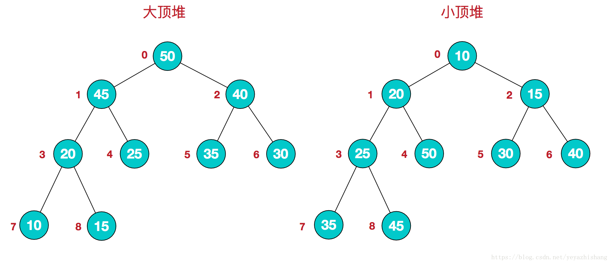
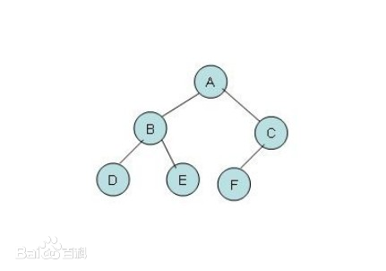
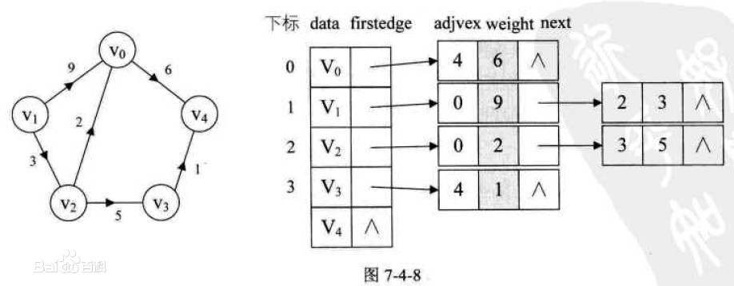

##### 2020-10-20  开个新坑，今天开始看数据结构和算法，这事拖好久了！
#### 1.什么是数据结构
其实数据结构没我以前想的那么高不可攀。数据结构就是带有一定结构特征的数据集合，不同的结构决定了他们会有不同的特性。我们重点需要了解8种常用的数据结构：数组、栈、堆、队列、链表、树、图、散列表。现在主流的编程语言基础库中基本都已经实现好了这八种常用数据结构，下面我们分别说明这些数据结构和他们的特性。
1. 数组 (Array)
数组，就是计算机中的一片连续内存。因为连续，所以它的IO代价是最小的；缺点也很明显，只能存放一种类型的数据，不能扩容。
适用场景：
频繁查询，对存储空间要求不大，很少增加和删除的情况
2. 链表 (Linked List)
链表和数组很像，但是链表不是连续内存。链表中的每一个元素都包含连个结点：一个是存储元素的数据域 (内存空间)，另一个是指向下一个结点地址的指针域。根据指针的指向，链表能形成不同的结构，例如单链表，双向链表，循环链表等。
链表的优点： 
链表基本算是我目前使用最多的一种数据结构。不需要初始化容量，可以任意加减元素。 因为有指针域的存在，添加和删除元素非常快
缺点：
因为需要额外的空间来存储指针域，会占用更大的空间；查找元素时需要遍历链表，比较耗时。Java api中的链表能通过下标访问，本质也是有一个遍历过程的。只是基础库将他们封装了。
适用场景：  
数据量较小，需要频繁增加，删除操作的场景
3. 栈 (Stack)
一种特殊的线性表，只能在栈顶操作元素。也就是我们常说的"先进后出".经常用于重要数据的现场保护
4. 队列 (Queue)
也是一种线性表，和栈相比，它允许在一端添加元素，在另外一端取出元素。也就是先进先出。双向队列的实现原理？？？？
使用场景：
因为队列先进先出的特点，在多线程阻塞队列管理中非常适用。
5. 堆 (Heap)
堆是一种特殊的树形数据结构，一般讨论的堆都是二叉堆。根据顶点元素的大小可以分为大顶堆和小顶堆。

6. 散列表 (Hash)
散列表，也叫哈希表，是根据关键码和值 (key和value) 直接进行访问的数据结构，通过key和value来映射到集合中的一个位置，这样就可以很快找到集合中的对应元素。

7. 树 (Tree)
树是典型的非线性结构.具有如下特点：
1、每个结点最多有两颗子树，结点的度最大为2。 说人话就是每个节点最多只能有两个子节点。
2、左子树和右子树是有顺序的，次序不能颠倒。 (节点元素的存入必须有序)
3、即使某结点只有一个子树，也要区分左右子树。
二叉树是一种比较有用的折中方案，它添加，删除元素都很快，并且在查找方面也有很多的算法优化，所以，二叉树既有链表的好处，也有数组的好处，是两者的优化方案。
实际使用中mysql的B+树，HashMap地址源码中的红黑树都是由它衍生出来的

8. 图 (Graph)
图是一种比较复杂的数据结构，在存储数据上有着比较复杂和高效的算法。目前还没用到，后续在补充
