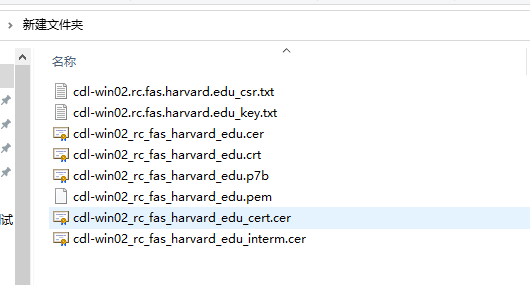

事情起因：
客户需要给项目配置https，已经像正规的CA机构购买了证书，但是配置后浏览器始终提示证书不安全。
客户在购买完证书后收到一封邮件，上面有很多个下载地址链接。下载完成后会得到一堆的文件。我当时看到也是一脸懵逼，说好的密钥文件呢？哪个是？

网上给出的配置方法基本都是说正式的CA证书很贵，会让你使用keytool自己签一个证书玩。
这种做法也没错，配置方法是对的，但是忽略了证书文件的生成。
tocmat中配置https只需要如下配置
```xml
<!-- 将tomcat/config/server.xml 中的如下部分放出来就好
    keystoreFile 修改为自己的证书文件，keystorePass修改为证书生成时输入的密码
 -->
<Connector port="443" protocol="HTTP/1.1" SSLEnabled="true"
               maxThreads="150" scheme="https" secure="true"
               clientAuth="false" sslProtocol="TLS" 
			   keystoreFile="F:\apache-tomcat-8.5.35\conf\b.pfx" 
			   keystorePass="123456"/>
```
```xml
<!-- 然后将tomcat/config/web.xml最后面添加-->
  <welcome-file-list>
        <welcome-file>index.html</welcome-file>
        <welcome-file>index.htm</welcome-file>
        <welcome-file>index.jsp</welcome-file>
    </welcome-file-list>
	<!-- Authorization setting for SSL --> 
	<login-config> 
		<auth-method>CLIENT-CERT</auth-method> 
		<realm-name>Client Cert Users-only Area</realm-name> 
	</login-config> 
	<security-constraint>  
		<web-resource-collection > 
			<web-resource-name >SSL</web-resource-name> 
				<url-pattern>/*</url-pattern> 
			</web-resource-collection> 
			<user-data-constraint> 
			<transport-guarantee>CONFIDENTIAL</transport-guarantee> 
		</user-data-constraint> 
	</security-constraint>
```
这样就配置完成了。
##### 重点是里面的证书文件怎么得到？
jdk中的keytool生成的证书tomcat是可以直接识别的，但是你向CA机构购买证书时不会得到tocmat能直接识别的证书文件。因为CA机构只负责发证，而web容器会有很多厂商，很多种实现。你需要根据CA机构提供的证书来生成对应web容器可以识别的证书文件。
以我遇到的问题为例，我需要使用CA机构提供的pem文件来生成一份能够被tomcat识别的证书文件。命令如下：
```shell
#通过openssl生成证书，key.txt 和.pem文件都能通过CA机构获取到。a.pfx文件就是最终能被tomcat识别的证书文件。
[root@localhost test1211]#  openssl pkcs12 -export -out a.pfx -inkey cdl-win02.rc.fas.harvard.edu_key.txt -in cdl-win02_rc_fas_harvard_edu.pem
Enter Export Password:
Verifying - Enter Export Password:
[root@localhost test1211]# ls
a.pfx  cdl-win02.rc.fas.harvard.edu_key.txt  cdl-win02_rc_fas_harvard_edu.pem
```
openssl需要单独安装，一般linux上默认都是已经安装好了的。
拿到证书文件后就能直接在tomcat中配置了。

###### 2020-12-15 补充
今天客户将旧证书注销了，然后又申请了一张失效更久的证书，还什么信息都没提供就说访问不了，关键他还把注册信息修改了几个字母，查到我怀疑人生。
这里记录下证书配置的整个流程：
首先，你要向ca机构申请证书，需要提交一份csr文件。这份文件怎么来呢？常见的有三种方式：
1.通过网站等在线生成。
2.通过keytool生成
3.通过openssl生成
有些工具网站会直接提供这三种生成方式，例如：https://myssl.com/csr_create.html
我们分别来说明下这三种方式的处理流程
第一步：得到csr文件，提交给CA机构 
a.通过网站等在线生成，你通常会得到一份csr文件和一份key文件。csr文件是要提交给CA机构的，里面包含了你的注册信息和公钥；key文件中包含与公钥对应的私钥。
b.如果你是通过keytool生成，对方会给你一段命令行，在jdk下执行命令会得到一个jks文件，然后你需要执行命令`keytool -certreq -alias myserver -keystore MyServer.jks -file MyServer.csr`，依据jks文件来得到csr文件提交给CA机构。
openssl的操作和keytool原理上差不多，只是命令不同。
第二步：获取证书
在你提交csr文件并付款后会收到一份邮件，里面包含N个链接，可以下载回来很多份文件(CA机构不同，邮件内容大同小异)。
如果你提交的csr是在线生成的，你可以通过openssl命令`openssl pkcs12 -export -out tomct证书文件.pfx -inkey 私钥 -in ca证书.pem` 生成tomcat可以直接识别的证书。
如果提交的csr是keytool生成的，你需要将邮件中的.crt文件导入jks中，命令如下`keytool -import -alias myserver -file MyServer.crt -keystore MyServer.jks -trustcacerts`。
然后你的jks文件就能直接配置在tomcat中了。
为什么会有这种差异呢？
因为RSA的私钥生成是不可逆的，同样的注册信息，在线生成方式中的csr文件和key文件内容每次点击都会生成不一样的结果。jks里面同时包含了注册信息、公钥和私钥。