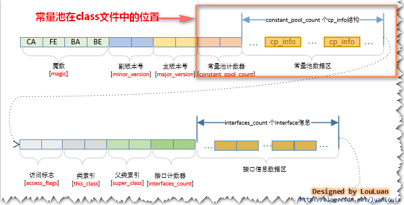

1.什么是双亲委派模型？
答:就是当一个类加载器收到加载请求时，会先让自己的父级加载器去尝试加载它。父加载器也一样，递归向上委派。如果父加载器已经加载过了，就不会再加载该类，父类加载器在自己的范围内找不到指定的类时，子类才会自己加载。
2.为什么使用双亲委派模型，这样做的好处是什么?
答:安全，确保核心类库不会被篡改。
jvm将类加载器分为4类：
启动类加载器(Bootstrap ClassLoader)：最顶层的类加载器，负责加载`<JAVA_HOME>/lib/rt.jar`这个文件，该jar包下都是以java、javax、sun等开头的类，也就是java最核心的那部分类。java.lang*，list，set等都在这个jar里面。
扩展类加载器(Extension ClassLoader):负责加载`<JAVA_HOME>/lib/ext/`包下的jar包。我点开几个看了下，感觉很陌生，基本都是没用过的类。
上面两个类加载器加载的都是指定路径下的jar文件，一般我们不用修改，可以认为它就是jvm层面的东西，实际编码中几乎不会用到。
应用程序类加载器(Application ClassLoader):加载classPath下的类库，也就是我们写的那些代码，和代码中的依赖库
自定义类加载器(User ClassLoader):这个才是和我们编码息息相关的加载器，我们平时调用的classLoader就是属于这一类。
因为上两层的加载器会优先启动并加载jar包，因此在双亲委派模型下可以避开应用程序层面篡改jvm中的核心库。
3.java中的类加载机制是什么样的？
答：前面说了双亲委派模型，在确认类需要被加载后，jvm会使用对应的加载器加载class文件。
JVM的类加载分为：加载-连接-初始化 三个部分。
加载：在此环节，jvm规范只是规定了“通过全类名获取定义此类的二进制字节流”，并没有指定从哪里获取，怎样获取。因此可以是通过文件，也可以是通过网络。只要符合格式就可以。
连接：在这个过程中jvm会验证class格式，加载其中的static变量，并将常量池内的符号引用替换为直接引用(参考常量池中的string类型)。
初始化：它是类加载的最后一步，也是真正执行类中定义构造方法的过程。当遇到以下情况时jvm才会去主动初始化对象：
  1.遇到new关键字，或者访问类中的静态方法或变量时
  2.使用反射包操作类时，如果类没有被初始化，就先初始化在操作
  3.打算初始化一个类，但是其父类还未初始化时，先初始化父类，在初始化它
  4.jvm启动时，自动初始化包含main方法的哪个类
  5.jdk1.8中提供了default方法的接口，当其实现类被初始化时，会优先初始化该接口
最后还有一个卸载环节，当类的所有对象都会回收，类本身没有在被引用，且该类的加载器实例也被GC时，类会被销毁。
注意：4种加载器中，前三种是JDK自带的，因此不会被回收。最后一种自定义加载器，因为java是面向对象的，自定义的加载器本身也是一个对象，当该对象不再被使用时，同样可以被回收。
4.说到内存回收，在说下你对jvm内存模型的理解，还有它的垃圾回收机制。
JVM中的内存划分大致可以分为两个部分：栈和堆，方法区不是强制要求的一部分。
a.方法区 只是一个没有强制要求的概念。《java虚拟机规范》中方法区被称为“Non-Heap(非堆)”，规范是定义了方法区的概念和作用，并没有规定应该如何实现。它就像java中的接口，只是一个说明，可以不做实现。而hotspot这款虚拟机实现了“方法区”并将他叫做“永久代”,在1.8时又使用“元空间”替代了这个区域的作用。早期的“永久代”使用JVM内存，而“元空间”使用直接内存，可以在一定程度上避免OOM。
方法区中保存的数据有两大类：1.class文件信息，2.运行时常量池。
方法区里的class文件信息包括：魔数，版本号，常量池，类，父类和接口数组，字段，方法等信息，其实类里面又包括字段和方法的信息。
运行时常量池又包括：字面量和符号引用两类，

b.栈 包括java虚拟机栈、本地方法栈和程序计数器。我们通常所说的栈指的是虚拟机栈。实际上java虚拟机栈是由一个个栈帧组成，每个栈帧都拥有自己的局部变量表、操作数栈、动态链接、方法出口信息。
本地方法栈作用和虚拟机栈差不多，虚拟机栈为java方法服务，本地方法栈为native方法服务，在hotspot中两者是合在一起的。
程序计数器，可以认为是当前线程所执行的字节码的行号指示器，在线程切换后能恢复到正确的位置。
c.堆 用于存放对象实例，遇到new关键字就必定会在堆中创建一个实例对象。它是内存结构中最大的一块。
关于垃圾回收，hotspot采用分代回收机制：
对象会优先在eden区分配，未被回收的对象进入Survivor区并且年龄+1.默认情况下年龄到达15的会进入老年代中，对象晋升到老年代的年龄阈值，可以通过参数 -XX:MaxTenuringThreshold 来设置。
为什么要采用分代回收呢？因为连续内存的申请和读写效率较高，当某片内存区域被读写一段时间后，就需要对里面的对象进行分代复制，然后清理出一片连续的内存空间。
常见的回收算法有两种：
1.引用计数器，现在基本废弃，因为对象间的相互引用可能导致对象无法被回收。
2.可达性分析算法，GC root对象不能到达的对象将被回收。GC root对象包括：虚拟机栈(栈帧中的局部变量表)中的引用对象、本地方法栈中JNI引用的对象、方法区中类静态属性引用的对象、方法区中常量引用的对象。4者都不在引用的对象将被标记回收。
