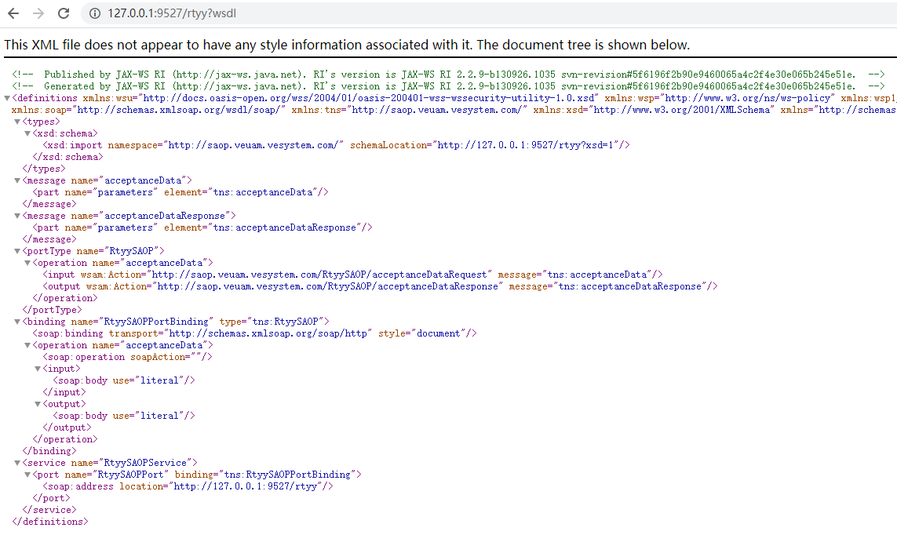

###### 最近在对接一个单点登陆系统，对方给了个wsdl连接就默认我们都懂了。其实我是一脸懵逼~~~
### WebServcie是什么？和servlet有什么关联吗？
servlet java对web方向容器定义的一种规范，一般web服务器厂商会按照这个规范去是处理资源的调用和回收，我们编码时也会写一些初始化资源和回收资源的代码，它是java中独有的。
WebService 是一种跨编程语言、跨操作系统平台的远程调用技术，它只是一个概念。
### WebServcie 和 SOAP、WSDL是什么关系？
上面说了WebService 是一种远程调用技术，它本身并没有任何的实现，它就是一个概念。
SOAP是这个概念下的一种具体协议，SOAP协议 = HTTP协议 + XML数据格式。(ps：我们以前用的都是json)。
WSDL可以认为是一种接口描述文件。
WebService的思想就是通过web向外提供服务。WSDL描述了自己能向外提供那些服务(方法名、参数列表、返回值等)，SOAP提供了调用方式(通过http，使用xml格式发送数据)。
### java中怎么使用？
WebServcie是一种跨平台的交互概念，java作为web方向的扛把子，默认就提供了这部分支持。
1. 编写一个service 在class上添加`@WebService`注解。该注解在 javax.jws下，是jdk自带的。
```java
@WebService//表明这是一个WebService，这些注解是可以和spring中的注解共存的
@Service
public class RtyySAOP  {
    private static Logger log = LoggerFactory.getLogger(RtyySAOP.class);
    
    public String acceptanceData(String info){
        log.info("收到对接信息：" + info);
       //....
        return info;
    }
}
```
2. 发布这个服务,你可以在main方法或者其他监听器中启动它
```java
public void loadingSAOPServer(){
    Endpoint.publish( "http://127.0.0.1:9527/rtyy",new RtyySAOP());
}
```
这样我们就写好了一个webservice。当我们访问`http://127.0.0.1:9527/rtyy?wsdl` 时会得到一个xml文件，该xml就描述了调用刚才的service的调用方式。

看不懂没关系，JDK看得懂。JDK提供了一个工具，可以根据接口直接生成对应的java和class文件，参考GRPC中根据proto生成对应代码。
具体流程如下：
1. jdk/bin目录下有一个wsimport.exe文件，通过它生成代码。执行命令 `wsimport -keep http://127.0.0.1:9527/rtyy?wsdl` 会在当前目录下生成对应的包文件夹，里面包含java文件和class文件，我们写代码一般负责java文件到自己的项目中就好。
2. 在代码中调用。
```java
// 实例化 webservcie对象。这个类是上面的脚本自动生成的类
RtyySAOPService service = new RtyySAOPService();
// 调用服务，获取到返回值。
String res = service.getRtyySAOPPort().acceptanceData("你好");
System.out.println( res );
```
整个过程和GRPC几乎是一毛一样的。
上面调用方式的本质也是发送了一个http请求，将参数组装为xml格式发送给了webService。工具类Hutool对于WebService调用也提供了很好的支持。
```java
// 新建客户端
SoapClient client = SoapClient.create("http://www.webxml.com.cn/WebServices/IpAddressSearchWebService.asmx")
    // 设置要请求的方法，此接口方法前缀为web，传入对应的命名空间
    .setMethod("web:getCountryCityByIp", "http://WebXml.com.cn/")
    // 设置参数，此处自动添加方法的前缀：web
    .setParam("theIpAddress", "218.21.240.106");

    // 发送请求，参数true表示返回一个格式化后的XML内容
    // 返回内容为XML字符串，可以配合XmlUtil解析这个响应
    Console.log(client.send(true));
```
虽然微服务推荐的搞法是restFULL，但是WebService因为出来的早，目前依然占有很大的市场份额。soap的xml编写也是有语法规范的。实际用到时再去细看。