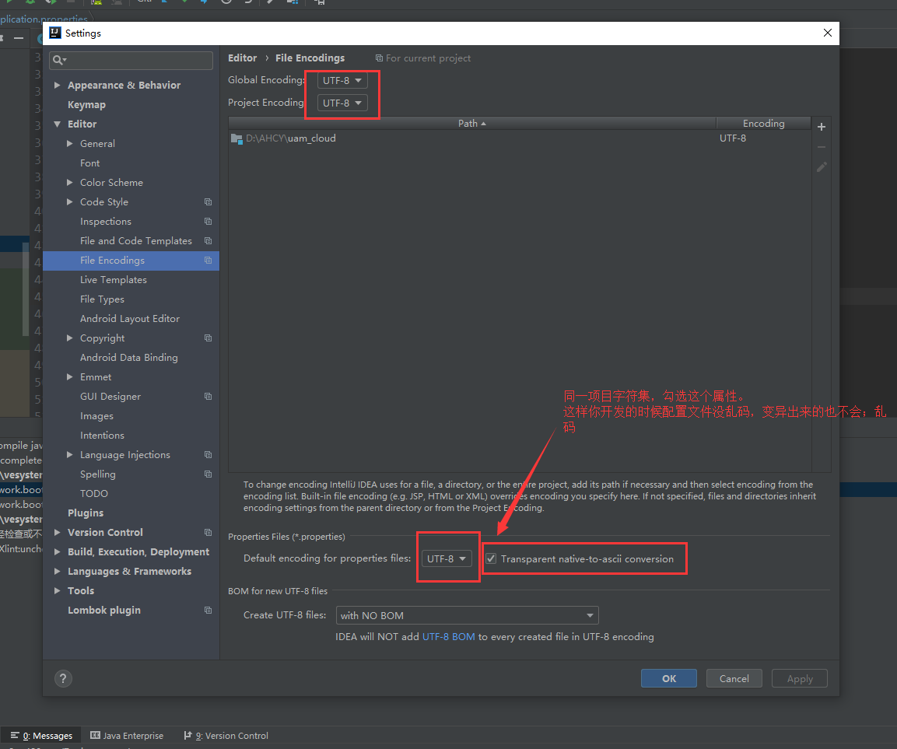

>1 配置文件中的注释在变异后变为乱码！
解决办法：修正setting-->file encodings--->Global Encoding 和 Project Encoding 都设置为UTF-8，同时勾选Transparent native-to-ascii conversion。如图：

补充：[github链接](https://github.com/judasn/IntelliJ-IDEA-Tutorial/blob/master/theme-settings.md) 有几乎idea下所有的乱码解决方法