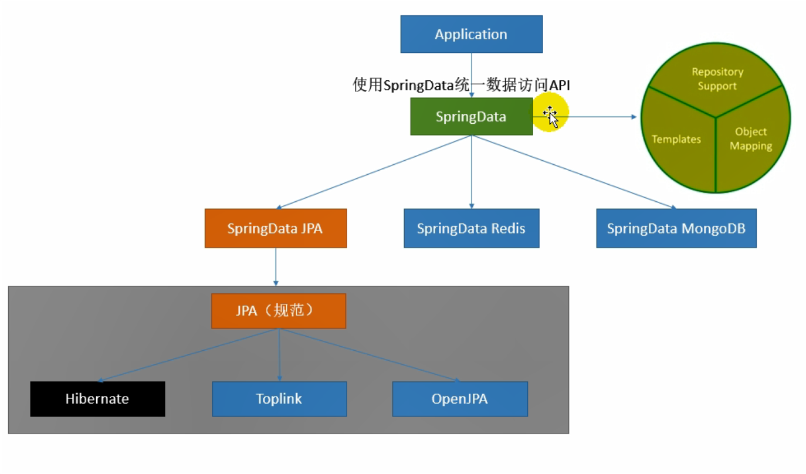

#### 2019-12-12
>springboot用了有差不多一年半的时间了，但是很多东西感觉还是停留在使用上，并没有深刻理解它的原理。朋友说只要spring和springboot能理解透，spring cloud就是水到渠成的事情，从今天开始系统学习springboot
#### 1.springboot常用注解
1. **@EnableAutoConfiguration**  自动配置注解。该注解会让springboot开启自动配置扫描，所有符合规范的bean都会注册到spring的ioc容器中。
通过`spring-boot-autoconfigure-1.5.9.RELEASE.jar`中的`spring.factories`清单，我们可以查看到所有springboot已经定义好的各种可装配组件。
我们也可以通过相同的规则来定义自己的可装配组件。
2. **@ConfigurationProperties**  配置属性赋值注解，通过配置文件给bean属性赋值。它只能为容器内的是组件赋值，通常要和@Component等配合使用。
**@PropertySource** 指定配置文件的路径，不使用该注解时ConfigurationProperties会默认读取application.properties
```yml
person:
    username: hcy
    age: 28
    isBoss: false
    # 时间只能用这种格式，1991-09-09 这种格式无法解析，项目启动时就会报错
    birth: 1991/09/09
    # 这个是map的数据格式
    maps: [k1: v1,k2: 6000]
    # list的数据格式
    lists:
      - lisi
      - zhaoliu
    # 对象的数据格式
    dog:
      petName: 田园犬
      petAge: 7
```
```java
/**
 * @auther hcy
 * @create 2019-12-12 15:29
 * @Description
 * @ConfigurationProperties(prefix = "person") prefix为映射前缀。
 * 它的效果和@value差不多，区别是@value是spring的底层注解，只能用在属性上，且@value不支持复杂类型数据比如 map，list 就不能注入值
 * @PropertySource 用来指定要读取的配置文件，默认读取application.properties
 */
@Data
@Component
@PropertySource(value = {"classpath:person.properties"})
@ConfigurationProperties(prefix = "person")
public class Person {
    private String username;
    private Integer age;
    private Boolean isBoss;
    private Date birth;
    private Map<String,Object> maps;
    private List<Object> lists;
    private Dog dog;
}
```
注意：properties文件也可以达到相同的效果，但是properties默认使用ascii码，因此要做如下配置才不会出现乱码情况，yml没有这种问题

3. **@ImportResource** 导入spring的bean.xml配置文件,类似早期SSM里面的注入方式。例如：
一、我们在resource目录下添加一个TestBean.xml文件，在其中添加bean。这点和早期SSM里面配置方式是一样的
```xml
<?xml version="1.0" encoding="UTF-8"?>
<beans xmlns="http://www.springframework.org/schema/beans"
       xmlns:xsi="http://www.w3.org/2001/XMLSchema-instance"
       xsi:schemaLocation="http://www.springframework.org/schema/beans http://www.springframework.org/schema/beans/spring-beans.xsd">
    <!-- id为ico容器中的类的名称，class为要注入的类 -->
    <bean id="helloService" class="com.example.demo.ymlDemo.HelloService"></bean>
</beans>
```
二、在springboot的启动类上添加@ImportResource并指定xml文件的位置，这样springboot启动时会扫描该xml文件将对应的类注册进ioc容器中
```java
// 指定要读取的bean xml文件的位置
@ImportResource(locations = {"classpath:TestBean.xml"})
@SpringBootApplication
public class DemoApplication {
    public static void main(String[] args) {
        SpringApplication.run(DemoApplication.class, args);
    }
}

@RunWith(SpringRunner.class)
@SpringBootTest
public class DemoApplicationTests {

    @Autowired
    ApplicationContext context;
    @Test
    public void test2(){
        // 通过ApplicationContext就能拿到刚才要注入的组件
        Boolean b= context.containsBean("helloService");
        System.out.println( b );
    }
}
```
springboot希望能尽可能的减少配置，推荐使用@Configuration来注册组件
4. **@Configuration**  指明当前类是一个配置类，用于替代原来的spring 的bean配置文件
```java
/**
 * @Configuration :指明当前类为一个配置类
 */
@Configuration
public class MyAppConfigaa {
    /**
     * @Bean 相当于配置文件中的 <bean><bean/>标签
     * 方法名等价于xml bean标签中的 id，对应容器中的id
     * 返回值等价于xml bean标签中的 class
     * 这里通过helloService2 就能获取到HelloService对象
     */
    @Bean
    public HelloService helloService2(){
        return new HelloService();
    }
}

@Autowired
    ApplicationContext context;

    @Test
    public void test3(){
        System.out.println( context.containsBean("helloService2") );
    }
```
@ImportResource加xml方式注入和直接通过@Configuration加@Bean注入，两种方式是等价的，且两种方式可以共存。
ioc容器不允许使用相同的id来注册bean，如果出现相同的注册id，会注册失败，项目无法启动。
spring.main.allow-bean-definition-overriding: true #允许注入相同id的bean，后面的会覆盖前面的
#### 2.springboot的依赖管理
springboot提供了版本依赖管理，只有通过parent中的dependencies能查到的才不需要声明版本号，没有的依然要声明版本。
```xml
<parent>
    <groupId>org.springframework.boot</groupId>
    <!-- IDEA中可以在点击后进入其中查看详细的依赖清单 -->
    <artifactId>spring-boot-starter-parent</artifactId>
    <version>1.5.9.RELEASE</version>
    <relativePath/>
</parent>
<!--必须要申明打包类型，jar和war都可以，否则上面的清单会呈现无法点击状态，清单中没有的在导入后还是需要写版本号-->
<packaging>jar</packaging>
```
#### 3.springboot的配置文件管理
springboot可以同时设置多个配置文件，但是默认会读取`application.properties`文件。可以在启动时添加参数`--spring.profiles.active=dev`来决定使用哪个配置文件。也可以在`application.properties`文件文件中添加`spring.profile.active=dev`来决定激活那个配置。
当项目被打包为jar时，如果需要修改配置文件，可以在启动命令中添加参数`java -xxx.jar --spring.config.location=外部配置文件路径`来直接使用外部配置文件。注意：`spring.config.location`在`application.properties`中配置是无效的。仅在命令行使用有效。springboot会同时从多个路径下读取配置文件，同样属性的配置按读取优先级顺序去最高的那个配置。因此在使用外部配置时我们可以只修改一部分属性，未涉及的配置依然会按jar包里面的配置文件来读取。
#### 4.springboot的自动配置原理
springboot提供了大量的可配置项，每个配置项又有很多个不同的属性可以设置，想要将它全部背下来基本是不可能的。但是只要搞清楚它的原理，就算不背我们也能知道应该如何设置。
springboot的自动配置分为3步：
一、获取装配清单。springboot启动时通过`@EnableAutoConfiguration`开启自动配置扫描，扫描所有依赖包下的`META-INF/spring.factories`文件，从而获取到自动配置清单。装配清单是一连串的完整类路径。注意：这里的`META-INF/spring.factories`路径和名称都是固定的，不能修改。
二、判断是否具备装配条件。我们随机点开配置清单中的一项。发现他的装配方式也是通过`@Configuration`+`@Bean`来实现的。例如：
```java
//配置类注解
@Configuration 
//可配置属性通过哪个类来获取，这个类中的属性和属性的set()对应springboot配置文件中可配置项的属性值
@EnableConfigurationProperties(HttpProperties.class) 
@ConditionalOnWebApplication(type = ConditionalOnWebApplication.Type.SERVLET)
@ConditionalOnClass(CharacterEncodingFilter.class)
//prefix-在读取配置文件时应该读取的属性前缀，如果某个属性未在配置文件中找到，就实用该属性的默认值。
@ConditionalOnProperty(prefix = "spring.http.encoding", value = "enabled", matchIfMissing = true)
public class HttpEncodingAutoConfiguration {

	private final HttpProperties.Encoding properties;

	public HttpEncodingAutoConfiguration(HttpProperties properties) {
		this.properties = properties.getEncoding();
	}
    // 如果ioc容器中没有注册过这个bean，就将它添加到ico容器中。
	@Bean 
	@ConditionalOnMissingBean
	public CharacterEncodingFilter characterEncodingFilter() {
		CharacterEncodingFilter filter = new OrderedCharacterEncodingFilter();
		filter.setEncoding(this.properties.getCharset().name());
		filter.setForceRequestEncoding(this.properties.shouldForce(Type.REQUEST));
		filter.setForceResponseEncoding(this.properties.shouldForce(Type.RESPONSE));
		return filter;
	}
.........
```
为了不打乱节奏,`@Conditional`系列注解最后面再说，先说完整个自动配置流程。
三、读取配置属性。通过`@EnableConfigurationProperties(class)`获取到配置属性类，调用其中的set()设置属性。
```java
// 配置属性赋值注解
@ConfigurationProperties(prefix = "spring.http")
public class HttpProperties {
    public Charset getCharset() {
        return this.charset;
    }
    // 有多少个set()方法就可以设置多少个属性
    public void setCharset(Charset charset) {
        this.charset = charset;
    }
}
```
springboot的自动配置只会将满足条件的组件进行注册。通过在`application.properties`中添加`debug=true`可以在控制台打印自动配置报告，虫二知道那些配置类生效了。
了解完自动装配后我们再来看看`@Conditional`注解，它的作用是判断指定条件是否成立，如果成立时才执行向容器中添加组件的逻辑。我们后期做自定义注解时应该也会用到，详细如下：
|@Conditional派生注解|作用|
|---|---|
|@ConditionalOnProperty|系统中指定的属性是否有指定的值|
|@ConditionalOnJava()|系统的java版本是否符合要求|
|@ConditionalOnResource|类路径下是否存在指定资源文件|
|@ConditionalOnEnabledResourceChain |检查spring是否启用资源缓存，对应配置spring.resources.chain.cache|
|@ConditionalOnClass|容器中有指定类|
|@ConditionalOnMissingClass|容器中没有指定类|
|@ConditionalOnBean |ioc容器中是否存在指定bean|
|@ConditionalOnMissingBean|ioc容器中不存在指定bean|
|@ConditionalOnSingleCandidate|容器中只有一个指定的bean，或者这个bean是首选bean|
|@ConditionalOnWebApplication|当前是web环境|
|@ConditionalOnNotWebApplication|当前不是web环境|
|@ConditionalOnExpression|满足指定spel表达式|
|@ConditionalOnJndi|jndi存在指定项|
补充：
1.spel表达式：spring提供的一种EL表达式，可以很简单的实现bean的属性值装配，比如：正则，算数、逻辑、关系运算，集合操作，属性访问等等。感觉这个好看，但是不实用，需要的时候再去研究
2.jndi，J2EE中的一种规范，也是为了解决应用解耦、扩展和部署问题。暂时用不到。
#### 5.springboot的日志管理
开发任何系统都应该养成良好的日志习惯，以后要坚决摒弃`System.out.println();`
我们点击`spring-boot-starter`发现它依赖于`spring-boot-starter-logging`,这就意味着springboot默认就装配了日志框架：slf4j+logback。
注意：springboot除了支持logback，也支持jul、log4j、jcl，但是必须要排除这几个日志自己的依赖。
具体用法：
1.通`LoggerFactory`获取到记录器，调用对应的日志方法就可以了，默认输出info级别以上的信息
```java
Logger logger = LoggerFactory.getLogger(getClass());
```
2.在springboot的配置文件中调整logback的日志输出
```pro
#调整日志级别
logging.level.com.example=trace
#调整日志输出方式，它和path差不多，区别是file是将日志写入指定文件；path是将日志写入指定目录。
# 当两者都有时file生效
logging.file=G:/springboot.log
logging.path=/spring/log
# 调整控制台的日志输出格式
logging.pattern.console=
# 调整日志文件的日志输出格式
logging.pattern.file=
```
3.springboot也支持更多更全面的日志方式，比如你可以在springboot的配置文件中指定logback的的配置文件，此时springboot就会完全安装你的配置来处理日志
```pro
#日志配置
logging.config=classpath:config/logback-spring.xml
```
注意配置文件名称。如果你直接将配置文件命名为`logback.xml`会导致项目启动时logback直接读取该配置文件的内容，而不是通过springboot来加载。这种模式下，是不能使用`springProfile`标签的。
```xml
<springProfile name="dev">
        <!--指定某段配置只在某个环境下生效，这个标签是springboot提供的。logback不能直接识别.
        name="dev" 表示仅在dev模式下标签内的配置才会生效。
        name="!dev" 表示除dev外的模式下，标签内的配置都会生效
        -->
</springProfile>
```
springboot文档建议是使用`logback-spring.xml`这个名称来定义日志配置文件。`logback-spring.xml`配置详见附件
#### 6.springboot的web MVC配置
**6.1.静态资源访问**。springboot有默认的springMVC配置，在默认规范下要访问到静态资源有两种方式：
一、将静态资源文件放入特定的文件夹。public和static目录下的文件默认是不会被拦截的
```pro
"classpath:/META-INF/resource",
"classpath:/resources",
"classpath:/static",
"classpath:/public"
```
二、以webjars的方式在pom.xml中引入资源依赖.这种方式的本质也是将一段资源文件放入了`classpath:/META-INF/resource`下
```xml
<dependency>
    <groupId>org.webjars</groupId>
    <artifactId>jquery</artifactId>
    <version>3.3.1</version>
</dependency>
```
ResourceProperties配置源码
```java
@ConfigurationProperties(prefix = "spring.resources", ignoreUnknownFields = false)
public class ResourceProperties {

	private static final String[] CLASSPATH_RESOURCE_LOCATIONS = { "classpath:/META-INF/resources/",
			"classpath:/resources/", "classpath:/static/", "classpath:/public/" };
            ......
```
我们可以通过配置来修改resource的路径：
```pro
# 配置resource路径，参数为一个数组，多参数使用逗号分隔
spring.resources.static-locations=classpath:/test1/,classpath:/test2/
```
springboot默认配置的模板引擎是thymeleaf，默认会在classpath:/templates/寻找对应模板。现在正式项目一般都是先后端分离开发，而且我要用也是用vue，这部分跳过。
**6.2.springMVC自动配置**
springboot在默认配置下会将所有实现了`WebMvcConfigurer`的接口全部纳入容器中逐个执行。也就是说我们的配置和springboot的默认配置都会生效。
```java
class WebMvcConfigurerComposite implements WebMvcConfigurer {
    //所有的WebMvcConfigurer都会被添加到delegates中，这个集合中的第一个元素就是springboot的默认配置，后面的才是我们添加的
	private final List<WebMvcConfigurer> delegates = new ArrayList<>();
    @Override
        public void addViewControllers(ViewControllerRegistry registry) {
            for (WebMvcConfigurer delegate : this.delegates) {
                delegate.addViewControllers(registry);
            }
        }
        .......
```
如果我们只希望自己的配置生效，可以在自己的`WebMvcConfigurer`上添加`@EnableWebMvc`。此时springboot的默认MVC配置会完全失效，不建议这么做。
**6.3.springboot的国际化**
springboot的国际化其本质是解析浏览器在发送http请求时在请求头中携带的`accept-language`信息.如果我们需要自定义国际化可以通过实现`LocaleResolver`接口来实现。
注意：在将MylocaleResolver注入到IOC容器时需要将方法名写为`localeResolver()`
```java
@Configuration
public class MylocaleResolver implements LocaleResolver {
    @Override
    public Locale resolveLocale(HttpServletRequest request) {
        // 自己的是实现方法
        return null;
    }

    @Override
    public void setLocale(HttpServletRequest request, HttpServletResponse response, Locale locale) {

    }
    //注意方法名只能用localeResolver()，因为默认的MVC中localeResolver注册判断条件是@ConditionalOnMissingBean
    @Bean
    public LocaleResolver localeResolver(){
        return new MylocaleResolver();
    }
}

```
```java
@Bean
//如果容器中没有localeResolver 就执行注入。
@ConditionalOnMissingBean
@ConditionalOnProperty(prefix = "spring.mvc", name = "locale")
public LocaleResolver localeResolver() {
    if (this.mvcProperties.getLocaleResolver() == WebMvcProperties.LocaleResolver.FIXED) {
        return new FixedLocaleResolver(this.mvcProperties.getLocale());
    }
    AcceptHeaderLocaleResolver localeResolver = new AcceptHeaderLocaleResolver();
    localeResolver.setDefaultLocale(this.mvcProperties.getLocale());
    return localeResolver;
}
```
**6.4.springboot的错误处理机制**
springboot默认的错误处理自动配置为`ErrorMvcAutoConfiguration`。默认情况下springboot会读取http请求头中的`content-type`。有两种处理方式：
一、如果是浏览器请求时发生错误会返回一个页面。页面默认路径为`classpath:/template/err/xxx.html`,当这个路径下找不到对应的文件时会去`classpath:/static/err/xxx.html`找。
`xxx.html`中的html名称必须是对应的错误代码，比如`404.html`,当请求发生404时springboot会自动返回这个404.html页面。也可以写`4xx.html`,此时任何4开头的错误都会返回4xx.html.
当404.html和4xx.html都存在时，精确匹配优先。
二、如果是其他应用请求发生的错误，则会返回一个json字符串。如果需要自定义json字符串的格式，可以通过`@RestControllerAdvice`+`@ExceptionHandler(value = 自定义异常.class)`来实现，推荐这种做法。
你也可以通过向容器中添加自定义的`ErrorAttributes`来实现。建议通过重写`DefaultErrorAttributes`来实现，代码如下：
```java
// 向容器中添加 自定义的ErrorAttributes组件，这里也可以换成 @Configuration +@Bean的注入方式
@Component
//@Configuration
public class MyErrorAttribute extends DefaultErrorAttributes {

    @Override
    public Map<String, Object> getErrorAttributes(WebRequest webRequest, boolean includeStackTrace) {
        Map<String ,Object> map = super.getErrorAttributes(webRequest,includeStackTrace);
        map.put("hcy","何重阳");
        return map;
    }
    //@Bean
    //public DefaultErrorAttributes errorAttributes(){
    //    return new MyErrorAttribute();
    //}
}
```
```java
// ErrorMvcAutoConfiguration 中关于errorAttributes的注入方式。
// DefaultErrorAttributes 本身也是继承自errorAttributes，不建议直接覆盖errorAttributes是想
// 尽可能的保留spring的默认配置
@Bean
@ConditionalOnMissingBean(value = ErrorAttributes.class, search = SearchStrategy.CURRENT)
public DefaultErrorAttributes errorAttributes() {
    return new DefaultErrorAttributes(this.serverProperties.getError().isIncludeException());
}
```
**6.5如何在springboot中配置servlet容器和引入servlet三大组件**
springboot支持tomcat、jetty、Undertow三种web容器，但是默认使用tomcat。如果我们需要替换web容器，只需要在springboot-web中排除tomcat的依赖，然后导入对应的web容器依赖就可以了。
这是因为springboot在三种容器上添加了一个抽象层，在给容器导入组件时，通过判断依赖是否存在来初始化正确的servlet容器实例。
同时，springboot默认不支持jsp，可以通过将打包方式改为war，在指定WEB-INF的位置就可以了。我不喜欢用jsp，这部分笔记忽略。
对于web容器的配置可以通过配置参数设置
```pro
# 所有web容器配置的前缀都是server.
server.port=8081
```
也可以通过代码配置，两者都有的情况下，以代码配置为准。下面是在springboot中配置servlet容器和3大组件的demo。
```java
//创建3大组件，这个按servlet规范写就好，ssm。、srpingboot等等都是一样的
public class MyServlet extends HttpServlet {
    @Override
    protected void doGet(HttpServletRequest req, HttpServletResponse resp) throws ServletException, IOException {
        System.out.println( "我是自定义的servlet" );
        doPost(req,resp);
    }
    @Override
    protected void doPost(HttpServletRequest req, HttpServletResponse resp) throws ServletException, IOException {
    }
}

public class MyFilter implements Filter {
    @Override
    public void init(FilterConfig filterConfig) throws ServletException {
    }
    @Override
    public void doFilter(ServletRequest servletRequest, ServletResponse servletResponse, FilterChain filterChain) throws IOException, ServletException {
        System.out.println( "我是自定义的filter" );
        filterChain.doFilter(servletRequest,servletResponse);
    }
    @Override
    public void destroy() {
    }
}

public class MyListener implements ServletContextListener {
    @Override
    public void contextInitialized(ServletContextEvent sce) {
        System.out.println("容器启动了");
    }
    @Override
    public void contextDestroyed(ServletContextEvent sce) {
        System.out.println("容器销毁了");
    }
}
```
```java
/**
 * @auther hcy
 * @create 2019-12-18 9:38
 * @Description 定义一个配置类，将上面的三大组件放入ioc容器中。
 */
@Configuration
public class MyMVCConfig {
    /**
     * 将自定义listener添加到容器中
     * @return
     */
    @Bean
    public ServletListenerRegistrationBean myListener(){
        ServletListenerRegistrationBean registrationBean = new ServletListenerRegistrationBean(new MyListener());
        return registrationBean;
    }
    /**
     * 将自定义filer放入容器中，注意拦截路径必须以“/”或者通配符开头，不然会出现启动错误，因为filer不知道要如何拦截
     * @return
     */
    @Bean
    public FilterRegistrationBean myFiler(){
        FilterRegistrationBean registrationBean = new FilterRegistrationBean();
        registrationBean.setFilter(new MyFilter());
        registrationBean.setUrlPatterns(Arrays.asList("/bbb"));
        return registrationBean;
    }
    /**
     * 将自定义的servlet注入IOC容器中，第二个参数为urlMappings，定义该servlet的触发时机。
     * @return
     */
    @Bean
    public ServletRegistrationBean myServlet(){
        ServletRegistrationBean registrationBean = new ServletRegistrationBean(new MyServlet(),"/hcyServlet");
        return registrationBean;
    }
    /**
     * 定制嵌入式servlet容器的相关规则，springboot 2.0以下版本使用 EmbeddedServletContainerCustomizer
     * 这里的配置等同于配置文件中的server.xxx,
     * 当两种配置都存在时，代码中的参数会生效。
     */
    @Bean
    public WebServerFactoryCustomizer<ConfigurableWebServerFactory> setWebServerFactoryCustomizer(){
        return new WebServerFactoryCustomizer<ConfigurableWebServerFactory>() {
            @Override
            public void customize(ConfigurableWebServerFactory factory) {
                factory.setPort(8081);
                .....
            }
        };
    }
}
```
#### 7.springboot_数据访问
这里我们主要记录三个知识点：连接池、mybatis和JPA.
**7.1 druid连接池**
springboot在2.0以前默认采用tocmat的连接池，2.0以后默认采用hikariCP的连接池，但是我习惯使用druid。
hikariCP 和druid都号称性能最高的连接池组件，但是早前的hikariCP没有监控模块，现在版本据说扩展了这个功能，但是需要额外的依赖和配置。加上我已经习惯了druid，这里记录下用法。
一、引入druid依赖，阿里有关于srpingboot的依赖,建议引入这个。
```xml
<dependency>
    <groupId>com.alibaba</groupId>
    <artifactId>druid-spring-boot-starter</artifactId>
    <version>1.1.10</version>
</dependency>
```
二、在配置文件中配置对应参数，将spring默认的datasource替换为druid
```yml
spring:
  datasource:
    url: jdbc:mysql://localhost:3306/mybatis_demo
    driver-class-name: com.mysql.cj.jdbc.Driver
    username: root
    password: 3.14
    type: com.alibaba.druid.pool.DruidDataSource
# 上面是比配属性，其他为可选择属性，根据实际情况配置
```
三、将druid注册到ioc容器中
```java
@Configuration
public class DruidConfig {
    /**
     * 指定druid启动时读取默认配置文件，配置项前缀为spring.datasource。
     * 这样才能更好的和spring.datasource无缝衔接
     * @return
     */
    @ConfigurationProperties(prefix = "spring.datasource")
    @Bean
    public DruidDataSource druid(){
        return new DruidDataSource();
    }
    /**
     * 该servlet提供了对连接池的监控功能，我最早就是因为这个功能才选择的druid。
     * 通过initParams设置相应的配置参数，StatViewServlet中可以看到详细的配置key
     * @return
     */
    @Bean
    public ServletRegistrationBean statViewServlet(){
        ServletRegistrationBean bean = new  ServletRegistrationBean(new StatViewServlet(),"/druid/*");
        Map<String,String> initParams = new HashMap<>();
        initParams.put("jmxUsername","root");
        initParams.put("jmxPassword","3.14");
        bean.setInitParameters(initParams);
        return bean;
    }
    /**
     * 就是上面那个servlet的拦截器，可以过滤掉你不想展示的功能。
     * 默认可以不配置，如果你没有什么忌讳的话！
     * @return
     */
    @Bean
    public FilterRegistrationBean webStatFilter(){
        FilterRegistrationBean bean = new FilterRegistrationBean();
        bean.setFilter(new WebStatFilter());
        Map<String,String> initParams = new HashMap<>();
        initParams.put("exclusions","*.js,*.css");
        bean.setInitParameters(initParams);
        bean.setUrlPatterns(Arrays.asList("/*"));
        return bean;
    }
}
```
注意：druid默认的页面在页脚会带有一段阿里云的广告，无法直接删除。如果时生产环境要用这个，建议自己下载源码修改后在用。
```js
//修改druid-1.1.10.jar!/support/http/resources/js/common.js文件，将下面这段话删除后在打包就不会在有广告了
buildFooter : function() {

			var html ='<footer class="footer">'+
					  '    		<div class="container">'+
					  '<a href="https://render.alipay.com/p/s/taobaonpm_click/druid_banner_click" target="new"></a><br/>' +
				  	  '	powered by <a href="https://github.com/alibaba/" target="_blank">AlibabaTech</a> & <a href="http://www.sandzhang.com/" target="_blank">sandzhang</a> & <a href="http://melin.iteye.com/" target="_blank">melin</a> & <a href="https://github.com/shrekwang" target="_blank">shrek.wang</a>'+
				  	  '			</div>'+
					  ' </footer>';
			$(document.body).append(html);
		},
```
**7.2 mybatis整合**
springboot中的mybatis依赖。原始的mybatis依赖也可以用，但是建议使用mybatis-spring-boot-starter。
```xml
<!-- JDBC驱动 -->
<dependency>
    <groupId>org.springframework.boot</groupId>
    <artifactId>spring-boot-starter-jdbc</artifactId>
</dependency>
<!-- mybatis -->
<dependency>
    <groupId>org.mybatis.spring.boot</groupId>
    <artifactId>mybatis-spring-boot-starter</artifactId>
    <version>1.3.2</version>
</dependency>
<!-- mysql驱动 -->
<dependency>
    <groupId>mysql</groupId>
    <artifactId>mysql-connector-java</artifactId>
</dependency>
```
mybatis使用分为注解版和配置xml文件版。使用大致分为三个步骤：
第一步、指定mybatis全局配置文件的位置。在springboot的配置文件中添加配置
```yml
# 指定mybatis全局配置文件的位置
mybatis.config-location=classpath:mybatis/mybatis-config.xml
```
```xml
<?xml version="1.0" encoding="UTF-8"?>
<!DOCTYPE configuration PUBLIC "-//mybatis.org//DTD Config 3.0//EN" "http://mybatis.org/dtd/mybatis-3-config.dtd">
<configuration>
	<!-- mybatis全局参数m,很多都是默认开启的。驼峰命名转换默认没有开启，建议增加这个配置，很好用 -->
	<settings>
		<!--<setting name="logImpl" value="LOG4J"/>-->
		<!-- 使全局的映射器启用或禁用缓存。 -->
		<setting name="cacheEnabled" value="true"/>
		<!-- 全局启用或禁用延迟加载。当禁用时，所有关联对象都会即时加载。 -->
		<setting name="lazyLoadingEnabled" value="true"/>
		<!-- 当启用时，有延迟加载属性的对象在被调用时将会完全加载任意属性。否则，每种属性将会按需要加载。 -->
		<setting name="aggressiveLazyLoading" value="true"/>
		<!-- 是否允许单条sql 返回多个数据集  (取决于驱动的兼容性) default:true -->
		<setting name="multipleResultSetsEnabled" value="true"/>
		<!-- 是否可以使用列的别名 (取决于驱动的兼容性) default:true -->
		<setting name="useColumnLabel" value="true"/>
		<!-- 允许JDBC 生成主键。需要驱动器支持。如果设为了true，这个设置将强制使用被生成的主键，有一些驱动器不兼容不过仍然可以执行。  default:false  -->
		<setting name="useGeneratedKeys" value="false"/>
		<!-- 指定 MyBatis 如何自动映射 数据基表的列 NONE：不隐射　PARTIAL:部分  FULL:全部  -->  
		<setting name="autoMappingBehavior" value="PARTIAL"/>
		<!-- 这是默认的执行类型  （SIMPLE: 简单； REUSE: 执行器可能重复使用prepared statements语句；BATCH: 执行器可以重复执行语句和批量更新）  -->
		<setting name="defaultExecutorType" value="SIMPLE"/>
		<!-- 使用驼峰命名法转换字段。 -->
		<setting name="mapUnderscoreToCamelCase" value="true"/>
		<!-- 设置本地缓存范围 session:就会有数据的共享  statement:语句范围 (这样就不会有数据的共享 ) defalut:session -->
        <setting name="localCacheScope" value="SESSION"/>
        <!-- 设置但JDBC类型为空时,某些驱动程序 要指定值,default:OTHER，插入空值时不需要指定类型 -->
        <setting name="jdbcTypeForNull" value="NULL"/>	
	</settings>
	<!--<plugins>
		&lt;!&ndash; com.github.pagehelper为PageHelper类所在包名 &ndash;&gt;
		<plugin interceptor="com.github.pagehelper.PageHelper">
			&lt;!&ndash;<property name="param1" value="value1"/>
			<property name="helperDialect" value="mysql"/>&ndash;&gt;
		</plugin>
	</plugins>-->
</configuration>
```
第二步、指定查询接口所在的位置,有两种方式.一是给所有的查询接口添加`@Mapper`注解，第二是在springboot的启动类上添加`@MapperScan(value = "com.example.demo.mybatisTest")`,value指定查询接口在的位置，路径可以是包名，表示扫描该包下的所有接口。
第三步、映射接口对应的sql语句。注解版和xml配置版的差异就在这里。
注解版示例：
```java
//mapper映射，告诉mybatis在项目启动时扫描这个接口
@Mapper
public interface MyDao {
    // 通过对应的 CRUD注解完成相应的操作，这种方式不需要写xml配置文件，代码逻辑一目了然
    @Select("SELECT * FROM `user` WHERE id = #{uersId}")
    User selectUserById(Integer uersId);
    // Options 指定在完场插入后返回插入的主键ID
    @Options(useGeneratedKeys = true,keyProperty = "id")
    @Insert(" INSERT INTO `user` (id,age,`name`,birthday,role_id) VALUES (#{id},#{age},#{name},#{birthday},#{roleId}) ")
    Integer insertUser(User user);
}
```
xml配置版演示：
注意：xml配置版需要在springboot的配置文件中指定xml文件的所在位置。第一步中的xml是mybatis的全局配置xml，这里说的是接口和sql语句映射的xml的位置。
```pro
# 指定sql语句所在的xml的位置，这里表示读取/mybatis/mappers/下的所有以Mapper.xml结尾的文件
mybatis.mapper-locations=classpath:mybatis/mappers/*Mapper.xml
```
```xml
  <!-- sql映射文件 -->
<?xml version="1.0" encoding="UTF-8" ?>
<!DOCTYPE mapper
  PUBLIC "-//mybatis.org//DTD Mapper 3.0//EN"
  "http://mybatis.org/dtd/mybatis-3-mapper.dtd">
  <!-- 指定该xml对应哪个mapper -->
<mapper namespace="com.vesystem.veuam.modules.user.dao.UserDao">
	<insert id="insertUser" parameterType="com.vesystem.veuam.modules.user.bean.User" useGeneratedKeys="true" keyProperty="userId">
		INSERT INTO `user` (login_name,username,`password`,user_role_id,icon,org_id,user_status,create_user_id,create_time) VALUES (
		#{loginName},#{username},#{password},#{userRoleId},#{icon},#{orgId},#{userStatus},#{createUserId},#{createTime})
	</insert>
</mapper>
```
**7.3 springData和JPA**
springData项目的目的是为了简化构建基于spring框架应用的数据访问技术。它包含很多个子项目，分别用于解决关系型数据库、非关系型数据库、云数据服务、全文检索，缓存等等一系列的数据场景。基本上现在主流的技术它都有对应的解决方案。
springData提供了一套统一的API接口来执行CRUD、查询、排序、分页等常用操作，再由接口去执行具体的数据库实现。这些API可以同时适配各种关系型和非关系型数据库，真正做到逻辑和持久层解耦。
简单来说就是可以做到将来换数据库类型后可以不改或少改代码！

springboot整合JPA也需要三个步骤：
第一步、引入依赖。注意，不需要mybatis的依赖，jpa自成一派！
```xml
<dependency>
    <groupId>org.springframework.boot</groupId>
    <artifactId>spring-boot-starter-jdbc</artifactId>
</dependency>
<dependency>
    <groupId>org.springframework.boot</groupId>
    <artifactId>spring-boot-starter-data-jpa</artifactId>
</dependency>
<dependency>
    <groupId>mysql</groupId>
    <artifactId>mysql-connector-java</artifactId>
</dependency>
```
第二步、创建一个dao层接口，提供泛型。这个接口不需要其他的注解就会自定注入到IOC容器中，不知道它怎么做到了。
```java
/**
 * 继承 JpaRepository 或者 JpaSpecificationExecutor 来完成数据库操作，
 * JpaRepository<操作的实体类类型,实体类中主键属性的类型>，封住了基本的CRUD操作
 * JpaSpecificationExecutor<操作的实体类类型> 封装了复杂查询(分页)
 * java类不支持多继承，但是接口是可以多继承的。
 */
public interface UserRepository extends JpaRepository<User,Integer>, JpaSpecificationExecutor<User> {
}
```
第三步、初始化对象，调用对应的API
```java
/**
 * 注意：springboot1.5 和2.0版本默认依赖的jpa API间的差异比较大，需要单独整理，应该是有规则的。
 * 这里用的1.5.9版本
 */
@RestController
public class JpaController {
    @Autowired
    private UserRepository userRepository;

    @RequestMapping("/findById/{id}")
    public User find( @PathVariable("id") Integer id){

        return userRepository.findOne(id);
    }
}
```
#### 8.springboot中的自定义starter
我们可以将一些常用的模块，比如用户和权限等所有系统都会要用的功能写成一个独立的starter。后续需要是使用时直接通引入依赖就能使用了，就像我们使用springmvc一样。具体操作流程如下：
1.创建一个新的springboot项目，删除springboot的启动类，删除pom文件中多余的依赖。删除后的pom文件如下：
```xml
<?xml version="1.0" encoding="UTF-8"?>
<project xmlns="http://maven.apache.org/POM/4.0.0" xmlns:xsi="http://www.w3.org/2001/XMLSchema-instance"
         xsi:schemaLocation="http://maven.apache.org/POM/4.0.0 https://maven.apache.org/xsd/maven-4.0.0.xsd">
    <modelVersion>4.0.0</modelVersion>
    <parent>
        <groupId>org.springframework.boot</groupId>
        <artifactId>spring-boot-starter-parent</artifactId>
        <version>2.2.2.RELEASE</version>
        <relativePath/> <!-- lookup parent from repository -->
    </parent>
    <!-- 这里的坐标就是将来别人要引入我们的jar时需要使用的坐标 -->
    <groupId>com.example</groupId>
    <artifactId>hcy-springboot-start</artifactId>
    <version>0.0.1-SNAPSHOT</version>
    <name>hcy-springboot-start</name>
    <description>Demo project for Spring Boot</description>

    <properties>
        <java.version>1.8</java.version>
    </properties>

    <dependencies>
        <!--删除其他所有的依赖，只保留spring-boot-starter这一个基本的启动器，需要通过它来触发spring-boot-autoconfigure。
        如果你删除了spring-boot-starter-test 这个单元测试依赖，请同时删除项目中的test文件夹 -->
        <dependency>
            <groupId>org.springframework.boot</groupId>
            <artifactId>spring-boot-starter</artifactId>
        </dependency>
    </dependencies>
    <!--删除maven插件，作为一个启动器，它只是ico容器中的bean，不需要那些东西-->
</project>
```
2. 创建一个配置类，用于定义所有可配置项
```java
package com.example.hcyspringbootstart;

import org.springframework.boot.context.properties.ConfigurationProperties;

/**
 * @auther hcy
 * @create 2019-12-29 16:25
 * @Description 将来别人引入了你的jar，可以直接在application.yml下配置你定义的属性，里面的每一个私有属性都是一个可配置项
 */
@ConfigurationProperties(prefix = "hcy.hello")
public class HelloProperties {

    private String prefix;
    private String suffix;

    public String getPrefix() {
        return prefix;
    }

    public void setPrefix(String prefix) {
        this.prefix = prefix;
    }

    public String getSuffix() {
        return suffix;
    }

    public void setSuffix(String suffix) {
        this.suffix = suffix;
    }
}

```
3.编写的你的实际业务service
```java
package com.example.hcyspringbootstart;

/**
 * @auther hcy
 * @create 2019-12-29 16:24
 * @Description 注意这里的helloProperties并没有使用任何@Autowired注解，因为这个对象的赋值是在下面一步中的config类中完成的，注意为helloProperties添加set方法，方便config类为其赋值。
 */
public class HelloService {

    HelloProperties helloProperties;

    public String sayHelloAtguigu(String name){
        return helloProperties.getPrefix() + "-" + name + helloProperties.getSuffix();
    }

    public HelloProperties getHelloProperties() {
        return helloProperties;
    }

    public void setHelloProperties(HelloProperties helloProperties) {
        this.helloProperties = helloProperties;
    }
}
```
4.编写自动配置类，springboot启动时才会将这个jar纳入到ioc容器中。
```java
package com.example.hcyspringbootstart;

import org.springframework.beans.factory.annotation.Autowired;
import org.springframework.boot.autoconfigure.condition.ConditionalOnWebApplication;
import org.springframework.boot.context.properties.EnableConfigurationProperties;
import org.springframework.context.annotation.Bean;
import org.springframework.context.annotation.Configuration;

/**
 * @auther hcy
 * @create 2019-12-29 16:29
 * @Description 
 */
@Configuration //表示这是一个配置类
@ConditionalOnWebApplication //在满足特定条件时才会注入这个bean，避免依赖问题
@EnableConfigurationProperties(HelloProperties.class) //表示这个bean所使用的配置文件是什么，有那些项可以配置，对应第二步中的HelloProperties.class
public class HelloServiceAutoConfiguration {
    @Autowired //初始化配置文件
    HelloProperties helloProperties;

    @Bean //初始化bean
    public HelloService helloService(){
        // 初始化service
        HelloService service = new HelloService();
        // 将配置文件设置到service中
        service.setHelloProperties(helloProperties);
        // 将service放入ioc容器中
        return service;
    }
}
```
5.在`resource`新建文件夹`META-INF`并在里面新建文件`spring.factories`,在里面添加如下信息
```pro
# 第一行是固定的，指向springboot的EnableAutoConfiguration
org.springframework.boot.autoconfigure.EnableAutoConfiguration=\
# 重第二行开始就是各个要被纳入自动装配的配置类的全路径。ico容器在启动时会更具这里的路径获得对应的classLoader初始化配置类，然后在初始化里面对应的@bean
com.example.hcyspringbootstart.HelloServiceAutoConfiguration
```
6.使用`install`将项目打包安装到maven仓库中 
这样一个自定义的starter就写好了。
找个时间将uam中的用户和权限改写为一个独立的starter，dao层使用mybatis-plus，简单sql使用AR模式，复杂sql使用xml