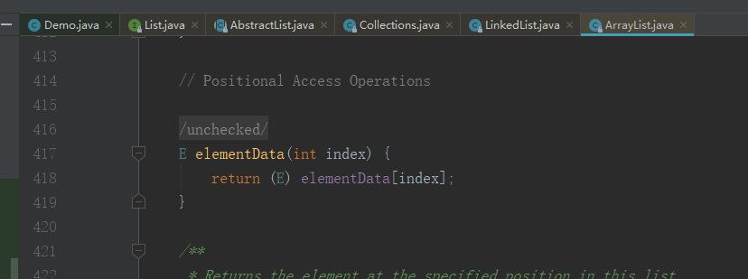
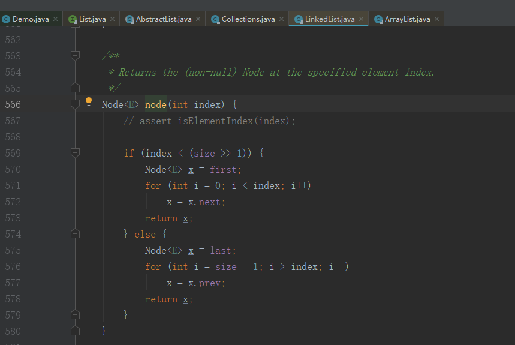
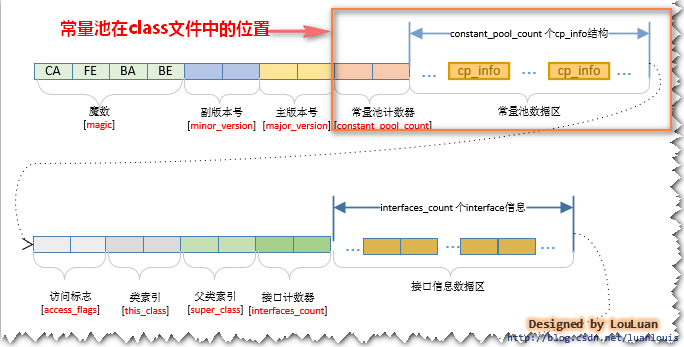
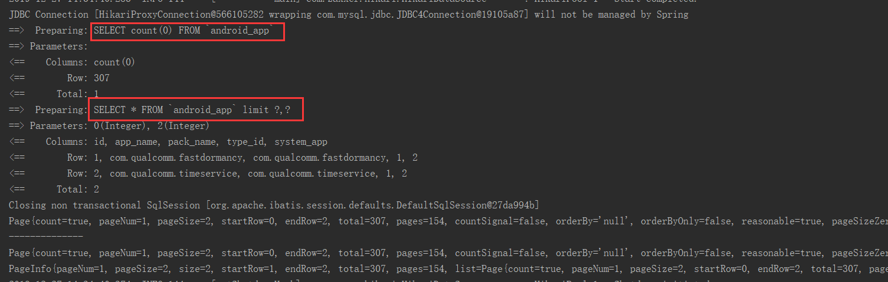

#### 成长就是今天比昨天有进步
##### 2019-11-06
1. 以后equals方法统一使用Objects下的equals方法，object下的方法可能存在空指针问题
2. 基本类型都有默认值，包装类默认null。浮点数应该使用BigDecimal，这样表示更加精确。大于long的整数使用BigInteger。阿里规范强制要求POJO对象属性、RPC方法返回值和参数必须使用包装类，推荐局部变量使用基本数据类型。
3. Arrays.asList()方法并不能将数组转换为真的list，底层还是一个数组(装饰器模式)，执行add(),remove()等集合方法时会报错。
4. Collection.toArray() 方法中的无参构造是个坑，建议使用有参构造指定数组数据类型。new String[0]可以节省空间
5. fail-fast机制：在迭代器创建后，以任何非迭代器方式试图修改列表结构时，迭代器都将抛出异常。单线程下也有可能出现这种情况。因此不要在foreach中执行remove/add操作，应该使用Iterator。Collection接口和concurrent包下的类都有这个机制。
##### 2019-11-07
1. 研究stream，所有涉及对Connection接口下的数据集合和数组进行聚合操作的都可以考虑使用stream。详见 java8_stream.md
2. ArrayList和LinkedList都是线程不安全的。区别是：
ArrayList底层使用Object数组，默认长度10，默认每次扩容为1.5倍的旧长度，尾部会预留空间不免频繁扩容。
LinkedList底层采用链表存储，删除和添加元素时不受元素位置影响。但是每个元素需要占用更多的空间。
在调用`get(int index)`获取元素时，ArrayList采用的是通过数组下标直接获取(优先for，其次foreach);而LinkedList采用iterator遍历获取。



如果是`List.get(int index)`在调用后会有一个判断过程。JDK中有一个`RandomAccess`接口，这个接口中没有任何实现。在`Connection`接口下有如下方法：
```java
public static <T>
    int binarySearch(List<? extends Comparable<? super T>> list, T key) {
        if (list instanceof RandomAccess || list.size()<BINARYSEARCH_THRESHOLD)
            return Collections.indexedBinarySearch(list, key);
        else
            return Collections.iteratorBinarySearch(list, key);
    }
```
所有实现了`Connection`接口的集合在遍历时都会去尝试将对象强转为RandomAccess。如果能强转就优先使用for，其次使用foreach；不能强转的直接使用iterator遍历。因此大数据千万不要使用普通for循环。foreach底层也是iterator
3. Vector 和ArrayList的API差不多，底层也是Object数组。可以认为它就是线程安全的ArrayList。多线程时建议使用Vector，单线程建议使用ArrayList。同时Vector的扩容算法为:增量为0时，扩容为原来大小的两倍，增量大于0时，扩容为原始长度+扩容长度。
```java
@Test
public void test2(){
    Vector  vector = new Vector();
    vector.add("aa");
    vector.remove("bb");
    vector.set(2,"cc");//java.lang.ArrayIndexOutOfBoundsException: Array index out of range: 2 因为底层是数组，这个时候还没有3个长度，所以炸了
    System.out.println( vector.toString() );
}
```
4. 关于比较、排序接口Comparable 和 Comparator 的用法
```java
 /**
     * Comparable 英 /ˈkɒmpərəbl/  adj. 类似的，可比较的；同等的，相当的 ；  一般定义在JOPO上，用于比较对象大小。实现该接口的对象才能调用Collections.sort(list)。
     * Comparator 英 /kəm'pærətə/   n. [仪] 比较仪；比测仪  ；用于在代码段中临时定义比较大小的方式。
     * 两者都是起比较作用，只是使用场景不一样。
     */
    @Test
    public void test3(){
        User u1 = new User("hcy",29);
        User u2 = new User("wcy",22);
        //System.out.println( u1.compareTo(u2) );
        List list = new ArrayList();
        list.add(u1);
        list.add( u2 );
        System.out.println( list.toString() );
        Collections.sort(list);//如果对象没有实现Comparable，则不能调用该方法。否则提示java.lang.ClassCastException: com.example.demo.ListDemo.User cannot be cast to java.lang.Comparable
        System.out.println( list.toString() );
        list.sort(new Comparator() {//Comparator
            @Override
            public int compare(Object o1, Object o2) {
                return 0;
            }
        });
    }
```
##### 2019-11-08
#### 总结java并发编程中的相关问题。
**线程安全的起因**：
>1.CPU执行线程指令是交替执行的，因此多线程修改同一变量可能出现相互干扰的情况。
2.CPU的执行效率远大于内存的读写效率，因此在cpu中存在一个Cache(寄存器)区域。cpu加载代码块时可能自动优化(指令重排序)。
3.java中存在线程工作区的概念，线程修改变量时会将变量拷贝到工作区修改后在写会主存，这个过程对其他线程是不可见的。  

**并发常用技术：**
>java并发编程必须要掌握的技术包括：synchronized，volatile，reentrantLock，ThreadLocal，线程池和原子操作。这里只记录概念，详细代码见 [并发编程.md]
synchronized 可以锁定代码段，也能锁定变量。JDK1.6前synchronized属于重量级锁，1.6后基本就不存在这些问题了。synchronized 关键字加到 static 静态方法和 synchronized(class)代码块上都属于类锁，只有修饰实例方法和代码块才属于对象锁。
volatile 该关键字只能修饰变量。被修饰的变量每次使用时都会从“主存”中取，而不是在各个线程的“工作内存”中取值。
volatile主要用于解决变量多线程间的可见性问题，但是不能保证数据的原子性，多线程交替访问不会发生阻塞。
synchronized 侧重点是解决资源访问的同步性，它是阻塞式操作，能同时保证可见性和原子性。实际开发中synchronized的使用场景比较多。
ReentrantLock 可重入独占锁。它的使用场景和synchronized差不多，但是比synchronized更加灵活。它提供了轮询、超时、中断等功能，但是synchronized会一直阻塞。
ReentrantLock继承自AQS，可以提供公平锁和非公平锁两种实现，其锁机制是通过API实现的。synchronized只能是非公平锁，依赖于JVM。可以认为ReentrantLock就是升级版的synchronized
ThreadLocal 可以认为它是一个容器，放入其中的变量在被线程调用时会为每个线程都创建一个副本，各个线程操作的都是属于自己的副本，因此不会产生阻塞也不能保证数据同步。使用ThreadLocal时一定要记得手动释放Value，阿里P3C插件中有对这一项的检查。
线程池 主要解决的是线程对象创建和销毁带来的消耗问题。Executors下的execute()和submit()两个方法都可以提交任务。区别是execute()是提交不需要返回值的任务，无法判断任务是否被线程池成功执行；sunmit()会返回一个Future对象，调用future.get()方法会阻塞当前线程直到任务完成。
原子操作 分为两部分：原子类和AQS原理。这两个我都只写过demo，没有实战经验。
AQS原理可以记录下：它的核心思想是，当访问的资源是空闲的时候就将当前请求资源的线程设置为有效的工作线程，并将资源锁定。其它线程再来访问就进入等待队列。
回顾参考：https://github.com/Snailclimb/JavaGuide/blob/master/docs/java/Multithread/JavaConcurrencyAdvancedCommonInterviewQuestions.md#22-%E8%AF%B4%E8%AF%B4-synchronized-%E5%85%B3%E9%94%AE%E5%AD%97%E5%92%8C-volatile-%E5%85%B3%E9%94%AE%E5%AD%97%E7%9A%84%E5%8C%BA%E5%88%AB

#### 2019-11-12
    1. RPC协议常见的调用方式有两种：
        a.以dubble为代表的基于TCP的调用，客户端通过socket将接口类，方法名和参数列表发送给服务端，服务端通过反射、动态代理等技术执行实现方法后通过socket返回结果。
        b.以springCloud为代表的基于http的调用，这种接口调用一般采用rest风格，参数和返回值一般以json格式保存。
    现在的dubble和springCloud都能同时支持TCP和http，只是大家的倾向重点不同。原则上TCP采用二进制，可以自定义协议内容，效率更高。HTTP协议中的无用内容过多，且对象序列化为JSON产生的消耗更大。因此dubble的效率更高，但是springCloud的生态更好。

    this 逃逸是指在构造函数返回之前其他线程就持有该对象的引用. 调用尚未构造完全的对象的方法可能引发令人疑惑的错误。
线程池相关知识点
主要解决的是线程对象创建和销毁带来的消耗问题。重点在于使用，还真没啥好总结的。记录下线程池中的几个比较重要的参数吧
ThreadPoolExecutor 3 个最重要的参数：
* corePoolSize : 核心线程数线程数定义了最小可以同时运行的线程数量。
* maximumPoolSize : 当队列中存放的任务达到队列容量的时候，当前可以同时运行的线程数量变为最大线程数。
* workQueue: 当新任务来的时候会先判断当前运行的线程数量是否达到核心线程数，如果达到的话，信任就会被存放在队列中。  

ThreadPoolExecutor其他常见参数:
* keepAliveTime:当线程池中的线程数量大于 corePoolSize 的时候，如果这时没有新的任务提交，核心线程外的线程不会立即销毁，而是会等待，直到等待的时间超过了 keepAliveTime才会被回收销毁；
* unit : keepAliveTime 参数的时间单位。
* threadFactory :executor 创建新线程的时候会用到。
* handler :饱和策略。当同时运行的的线程数达到最大值且队列也已经放满的时候应该如何处理。
    * ThreadPoolExecutor.AbortPolicy：抛出 RejectedExecutionException来拒绝新任务的处理。spring默认采用这种策略，建议使用。
    * ThreadPoolExecutor.CallerRunsPolicy：调用执行自己的线程运行任务。您不会任务请求。但是这种策略会降低对于新任务提交速度，影响程序的整体性能。另外，这个策略喜欢增加队列容量。如果您的应用程序可以承受此延迟并且你不能任务丢弃任何一个任务请求的话，你可以选择这个策略。
    * ThreadPoolExecutor.DiscardPolicy： 不处理新任务，直接丢弃掉。
    * ThreadPoolExecutor.DiscardOldestPolicy： 此策略将丢弃最早的未处理的任务请求。   

乐观锁和悲观锁：
悲观锁：每次操作都加锁，代表synchronized，适合“多写”场景，尤其是1.6优化后在多写场景下性能高于CAS
乐观锁：读不加锁，写时比较下数据是否有变化。代表是CAS，适合“多读”场景。CAS在读的时候是不加锁的，但是每次写操作的时候都会进行自旋比较。在多写场景下效率低于CAS。
#### 2019-11-15
JVM知识体系我大专将他们归纳为4个部分：类加载机制、内存划分、垃圾回收、JVM监控和调优.
>**类加载机制**
JVM的类加载分为：加载-连接-初始化 三个部分。
在“加载”环节，jvm规范只是规定了“通过全类名获取定义此类的二进制字节流”，并没有指定从哪里获取，怎样获取。因此可以是通过文件，也可以是通过网络。只要符合格式就可以。
类加载中还有一个重要的概念：双亲委派模型。简单来说就是每次加载类时都去检查下你的上级加载器是否已经加载过这个类，如果没有加载过就重上级加载器开始自顶向下尝试加载。这样可以避免重复加载带来的冲突。
反射就是自定义加载器的一个使用场景。
**内存结构**
JVM中的内存划分大致可以分为两个部分：栈和堆。
a.方法区 只是一个没有强制要求的概念。《java虚拟机规范》中方法区被称为“Non-Heap(非堆)”，规范是定义了方法区的概念和作用，并没有规定应该如何实现。它就像java中的接口，只是一个说明，可以不做实现。而hotspot这款虚拟机实现了“方法区”并将他叫做“永久代”,在1.8时又使用“元空间”替代了这个区域的作用。早期的“永久代”使用JVM内存，而“元空间”使用直接内存，可以在一定程度上避免OOM。
方法区中保存的数据有两大类：1.class文件信息，2.运行时常量池。
方法区里的class文件信息包括：魔数，版本号，常量池，类，父类和接口数组，字段，方法等信息，其实类里面又包括字段和方法的信息。
运行时常量池又包括：字面量和符号引用两类，

b.栈 包括java虚拟机栈、本地方法栈和程序计数器。我们通常所说的栈指的是虚拟机栈。实际上java虚拟机栈是由一个个栈帧组成，每个栈帧都拥有自己的局部变量表、操作数栈、动态链接、方法出口信息。
本地方法栈作用和虚拟机栈差不多，虚拟机栈为java方法服务，本地方法栈为native方法服务，在hotspot中两者是合在一起的。
程序计数器，可以认为是当前线程所执行的字节码的行号指示器，在线程切换后能恢复到正确的位置。
c.堆 用于存放对象实例，遇到new关键字就必定会在堆中创建一个实例对象。这里记录下java创建对象的过程，我感觉这部分内容中就“对象头”的概念比较重要，其他没什么用，但是很多帖子都说这部分内容很重要，先记录以后在慢慢品味。
java中的对象创建分为5个步骤：
①类加载检查： 虚拟机遇到一条new指令时，首先将去检查这个指令的参数是否能在常量池中定位到这个类的符号引用，并且检查这个符号引用代表的类是否已被加载过、解析和初始化过。如果没有，那必须先执行相应的类加载过程。
②分配内存： 在类加载检查通过后，接下来虚拟机将为新生对象分配内存。对象所需的内存大小在类加载完成后便可确定，为对象分配空间的任务等同于把一块确定大小的内存从Java堆中划分出来。分配方式有 “指针碰撞” 和 “空闲列表” 两种，选择那种分配方式由 Java 堆是否规整决定，而Java堆是否规整又由所采用的垃圾收集器是否带有压缩整理功能决定。
③初始化零值：内存分配完成后，虚拟机需要将分配到的内存空间都初始化为零值（不包括对象头），这一步操作保证了对象的实例字段在 Java 代码中可以不赋初始值就直接使用，程序能访问到这些字段的数据类型所对应的零值。
④设置对象头： 初始化零值完成之后，虚拟机要对对象进行必要的设置，例如这个对象是那个类的实例、如何才能找到类的元数据信息、对象的哈希吗、对象的GC分代年龄等信息。 这些信息存放在对象头中。 另外，根据虚拟机当前运行状态的不同，如是否启用偏向锁等，对象头会有不同的设置方式。
⑤执行 init 方法： 在上面工作都完成之后，从虚拟机的视角来看，一个新的对象已经产生了，但从 Java 程序的视角来看，对象创建才刚开始， <init> 方法还没有执行，所有的字段都还为零。所以一般来说，执行 new 指令之后会接着执行 <init> 方法，把对象按照程序员的意愿进行初始化，这样一个真正可用的对象才算完全产生出来。
**垃圾回收**
GC采用分代回收机制。对象会优先在eden区分配，未被回收的对象进入Survivor区并且年龄+1.默认情况下年龄到达15的会进入老年代中。还有一种动态年龄判断：Survivor 空间中相同年龄对象大小的总和大于Survivor空间一半的时候，大于或者等于该年龄的对象都会直接进入老年代。
对象回收算法常见的有两种：
1.引用计数器，现在基本废弃，因为对象间的相互引用可能导致对象无法被回收。
2.可达性分析算法，GC root对象不能到达的对象将被回收。GC root对象包括：虚拟机栈(栈帧中的局部变量表)中的引用对象、本地方法栈中JNI引用的对象、方法区中类静态属性引用的对象、方法区中常量引用的对象。4者都不在引用的对象将被标记回收。
关于引用：java将其分为4类：强‘弱、软、虚四类。
强引用：是最常见的，通过引用直接操作堆中对象的都属于这种类型。比如new
弱引用：只要GC触发就一定会被回收，即使堆空间很充足也会回收。我堆弱引用的使用场景理解是：如果你希望复杂对象(比如字符串、数组)用完后就被回收，可以考虑弱引用。这样可以省去GC跟踪带来的消耗。因为大对象会直接进入老年代，这个区域的垃圾回收并不频繁。如果是弱引用可以保证回收。
软引用：当内存紧张时JVM才会去考虑回收这片空间。
虚引用：基本等于没有引用，它的作用是用来跟踪垃圾回收过程。不用考虑这种引用。
关于强弱引用的使用场景我只遇到过一次。在android中服务间的消息传递是通过handler来传递的。当Activity被关闭时，handler中未被处理的消息无法释放。handler持有信息的引用，消息又引用了Activity，进一步导致对象无法回收。如果在自定义的handler子类上添加static关键字，就能解决这个问题。
原理是java中的非静态对象会持有当前类的强引用，而静态对象只会持有当前类的弱引用。在配合weakReference限制activity为弱引用类型。这样activity被意外结束，当内存不足时 messageQueue中的内容依然会被回收。

#### 2019-11-20
关于观察者模式。
>昨天有朋友问我如何实现在线程池执中的任务完成时去通知另外一个线程做相应的工作。我一时没反应过来。现在想来应该是使用观察者模式，当线程中的任务执行到某个阶段时，由观察者去通知另外一个线程执行逻辑。
那么观察者模式的代码要怎么写呢？整理代码后发现，所谓的观察者模式本身就是一方持有另外一方的引用，在特定的时候通过对象应用来执行对方的方法。在java中只有值传递一种方式，如果要使用对方的方法，必定要先持有对方的引用才能在特定时刻执行特定任务。而观察者模式中，通常会通过接口、构造函数等来添加观察者和被观察者间的关联关系  

```java
@Test
public void test2() throws FileNotFoundException {
    // 这两行代码包含了nio中的两个特性：
    // 1.内存映射文件，可以将磁盘上的文件不经过os内核缓冲区直接映射到用户私有的空间地址中。这个我也不太懂，只要记住，这样操作大文件速度快就可以了
    // 2.文件锁定，用于解决java程序和非java程序操作同一文件时可能出现的冲突。该功能依赖于操作系统提供的文件锁，未提供文件锁的系统上不能使用该功能。
    //    使用该功能可以达到的效果：java程序锁定某个文件或者某个文件的部分长度，此时其他程序是不能修改被锁定的部分的
    RandomAccessFile file = new RandomAccessFile("F:\\test.zip","rw");
    FileChannel fileChannel = file.getChannel();
}
```
    如果你希望你的方法可以返回多种数据类型，可以考虑将多种数据类型定义在一个枚举类中，然后将方法的返回值改为枚举类型。
#### 2019-11-21
>我早期记录过java 8中的lambda表达式、函数式接口和stream。今天又发现了两个好东西：Parallel Stream 和 Optionals，两者都是非常好用的功能。
***Parallel Stream*** 也叫并行流。它和早前记录的stream作用差不多，但是早前的那个是串行计算，这个是并行计算，效率更高。两者使用唯一的改动就是将stream() 改为parallelStream()。注意：map不支持stream操作，但是可以通过map.keySet().stream(),map.values().stream()和map.entrySet().stream()来变相使用。
***Optionals*** 它的作用是可以让我们更加优雅的防止在链式调用中出现NullPointerException。也能配合lambda表达式来做一些流程检查.
```java
@Test
public void test3(){
    Hcy hcy = new Hcy();
    Hage a = new Hage();
    a.setAge(null);
    a.setDes("aaa");
    hcy.setAge( a );
    //这里如果hcy.age为null，则hcy.age.intValue()方法抛出空指针异常.
    // 传统写法我们需要做很多的if(hcy.age !=null)的判断，在Optional中在链式调用的任何一环出现空指针都会执行orElse()方法中返回的值
    // 可以使代码整体更加优雅
    //System.out.println( hcy.age.intValue() );
    int age1 = Optional.ofNullable(hcy).map( hcy1 -> hcy1.age ).map(hage -> hage.age).orElse(-1);
    System.out.println( age1 );
    int age = Optional.ofNullable(hcy).map( hcy1 -> hcy1.age ).map(hage -> hage.age).orElseThrow(()->new RuntimeException("年龄为空"));
    System.out.println( age );
}
```
java 8中还提供了一系列全新的时间和日期api。clock类可以访问当前时间和日期，它是时区敏感的；ZoneId类提供静态方法来获取当前的时区信息。其他的几个时间API感觉和原来的没有太大的亮点。  
    
刚看到一段代码规范，大意是不要直接对HashMap进行序列化和反序列化传输，应该转换为以其他格式传输。我看下了HashMap源码，发现其中的多个字段（size，Set<Map.Entry<K,V>>，Node<K,V>[]）等都被transient修饰，同时它又自己重写了writeObject和readObject等方法。按道理来说它应该是可以进行序列化传输的。不懂为什么这样规范，可能有看不见的坑吧，以后接口层尽量不要返回Map。

浏览器访问url时会将url转换为IP地址，这个过程交过DNS查找，顺序是：浏览器缓存》路由器缓存》DNS缓存。
HTTP中的状态码大致可以分为5种：
1XX，一般表示请求正在处理，这个返回很少，我没遇到过。
2XX，表示成功，
3XX，一般是重定向，表示浏览器需要进行附加操作才能完成这次请求
4xx，表示服务器无法处理这次请求，比如找不到对应的资源
5xx，表示服务器收到了请求，但是在处理请求时发生了错误

#### 2019-11-22
1.set倾向于无序的不可重复集；list是有序数据集，支持通过下标来操作元素，访问效率高，但是插入和删除效率低；queue和list很像，只能在首尾操作元素，不支持下标操作。
#### 2019-11-25
1. 默认情况下后端的设置只能决定post请求所用的字符集，get请求不受`request.setCharacterEncoding()`的影响.如果发现get请求获取到的数据乱码，可以考虑修改tomcat容器中的字符集，修改如下：
```xml
<Connector port="8080" protocol="HTTP/1.1"
            connectionTimeout="20000"
            <!- 方案1：使用设置的字符集 ->
            redirectPort="8443" URIEnoding="UTF-8"/>
<Connector port="8080" protocol="HTTP/1.1"
            connectionTimeout="20000"
            <!- 方案2：使用后端给定的字符，受request.setCharacterEncoding()影响 ->
            redirectPort="8443" useBodyEncodingForURI="true"/>
```
2. AOP中的静态代理指的是AspectJ框架可以对java在编译期就完成一些代码的织入，但是这个过程需要依赖于特定的编译器(ajc编译器)。spring 采用的动态代理(JDK和CGLIB)回避了这一点，可以实现动态织入。  
3. RDB 全称：redis database，是redis默认采用的数据持久化方式，数据按照指定策略进行快照。
AOF 全称：append only file，会以文件追加写入的方式将redis中的所有操作都记录下来，类似mysql中的binlog。
#### 2019-11-27
1. 现在数据库大概可以分为4类：1.关系型数据库存储相对规则的数据，比如mysql；2.文档型数据库存储日志等多文字描述信息的数据,比如MongDB；3.内存数据库存储热点数据和实时变化的数据，比如redis；4.分布式文件系统存储图片、视频等流媒体文件，比如hadoop的HDFS、淘宝的TFS等。
全文检索和搜索引擎技术我认为它们应该属于搜索方式的优化，类似于数据库中的索引。并不能归于数据库中。
淘宝的海量数据被分散存储在上述的4种服务器种，通过UDSL调用查询。UDSL是一个类似JDBC的东西，通过它的API可以统一调用关系型数据库，redis，mongodb，isearch等查询。这样开发者不需要同时掌握这么多种技术就能直接使用这些技术。
2. 分布式数据库不同于传统的关系型数据库，没有ACID的概念。它追求的是CAP+BASE。
CAP：Consistency(强一致性)、Availability(可用性)、Partition tolerance(分区容错性)。
BASE:Basically Available(基本可用)、soft state(软状态)、eventually consistent(最终一致性)
BASE是为了解决“强一致性”引起的性能降低而提出的解决方案。其核心思想是放松系统对某一时刻的数据一致性要求来换取系统整体的伸缩性和性能改观。
#### 2019-12-17
1. IDEA中使用 Alt+7 可以查看类里面的所有方法
2. spring中的`@Order(num)`可以控制bean的初始化顺序，在AOP中则是控制切面执行顺序。数值越小，执行优先级越高。当有多个切面处在同一优先级时，执行顺序应该是按类名字母顺序执行的(我测试的结果这是这样的)，应该尽量避免这种同级情况。
#### 2019-12-20
@Resource 按名称装配，属于JDK提供的注解。
@Autowire 按类型装配，属于spring提供的注解。
idea中使用这两个注解有时会出现红色波浪线，是因为idea发现spring在ioc容器中无法预知这种类型。这种警告是不影响使用的，可以选择使用修改idea配置：
`Settings - Editor - Inspections - Spring - Spring Core - Code - Autowiring for Bean Class 勾去掉`
对于dao层接口可以使用`@Repository`注解。据说它和`@Service、@Controller 和 @Component`一样，都是分层标识bean而设计出来的。

#### 2019-12-23
EQ      equal                   等于
NE      not equal               不等于 
GT      greater than            大于
LT      less than               小于
GE      greater than or equal   大于等于 
LE      less than or equal      小于等于
这几个缩写在jquery和mybatis-plus筛选器中都有用到。

FTP分为主动和被动两种方式，默认的21端口只负责第一次连接，文件传输是在21连接成功后另外开启的一个端口上来进行的。
主动模式下：FTP服务会使用20端口和客户端的指定端口(N+1)进行文件传输，如果客户端的防火墙关闭了N+1端口，则文件传输失败。
被动模式下：FTP服务端会设置被动连接的IP地址和端口池。在21连接完成后，服务器会给客户端再次下发一个IP和端口(端口从端口池中随机取一个空闲的)，让客户端在连接一次。只要保证服务端设置的端口池都是开放的，就不会出现文件传输失败的情况。
#### 2019-12-25
http会将要发送的数据以明文的形式发送给浏览器，因此可以被中途拦截和篡改。
https会将要发送的数据通过私钥加密，然后再发送给浏览器；同时会用私钥生成一个公钥一起发送给浏览器，这个公钥是可以对数据密文进行解密的，但是不能对数据进行加密。因此https传输的数据依然可能被截获，但是无法被篡改。(被修改后的密文是无法被公钥解密的)
http2.0的特点：
1.二进制传输：2.0在应用层(http2.0)和传输层(tcp)间添加了一个二进制分帧层。这种模式更加接近于TCP通信，所有数据会被拆分为多个帧发送给客户端，然后通过分帧层将数据还原为headers+data两部分。这种二进制的数据传输效率要远高于1.x中的文本方式传输。
2.请求流程变化。假定我们现在有一个页面，页面包含一个css、一个js和一张图片。在http1.x下浏览器需要发起4次请求才能拿到所有的数据。但是在http2.0下只需要一次请求。当tcp握手完成后浏览器拿到的是一个响应索引。你可以认为它是一份清单，双方通过检查清单上的内容，确认哪些信息是自己本地没有的(header压缩，1.x中每次请求都会携带完整cookie)，然后依然是通过这个tcp通道向服务器索要这些数据。多个数据流共用一个tcp链接通道(多路复用)。数据被拆分为很多帧，每个帧上都会带有流标识用于重新组装数据(服务器push，这个过程感觉就是tcp通信)。由此可见整个页面的出现只需要一次http请求(一次tcp握手)就能完成。
注意：这些应用层的传输协议和我们基本无关，由web容器提供支持。tomcat 9开始支持http2.0，具体情况等我实际使用了再来补充。
#### 2019-12-27
1.实测mybatis的分页插件PageHelpler和mybatis-plus中的分页插件一样，都是物理分页，并不存在查询全部后在内存中做逻辑分页的情况！

PageHelpler在导入依赖后可以在springboot启动类中添加如下代码来启动插件
```java
@Bean
PageHelper pageHelper(){
    //分页插件
    PageHelper pageHelper = new PageHelper();
    Properties properties = new Properties();
    properties.setProperty("reasonable", "true");
    properties.setProperty("supportMethodsArguments", "true");
    properties.setProperty("returnPageInfo", "check");
    properties.setProperty("params", "count=countSql");
    pageHelper.setProperties(properties);
    //添加插件
    new SqlSessionFactoryBean().setPlugins(new Interceptor[]{pageHelper});
    return pageHelper;
}
```
`mybatis.configuration.log-impl=org.apache.ibatis.logging.stdout.StdOutImpl`可以开启日志输出。如果springboot已经使用slf4j，会出现冲突导致项目启动失败。没去研究解决办法，反正我基本不用这种写法了。

#### 2020-06-10
java中的泛型属于编译期检查并确定数据类型，通过反射可以绕开泛型检查。比如在`List<Integer>`中放入string类型。
```java
 @Test
public void t7() throws NoSuchMethodException, InvocationTargetException, IllegalAccessException {
    ArrayList<Integer> list = new ArrayList<>();//申明一个Integer的list
    list.add(1);
    list.add(2);
    Class listClass = list.getClass();
    Method m= listClass.getMethod("add",Object.class);
    m.invoke(list,"aaa");//通过反射调用add方法，将aaa字符串放入list中
    System.out.println( list.toString() );// [1, 2, aaa]
}
```
